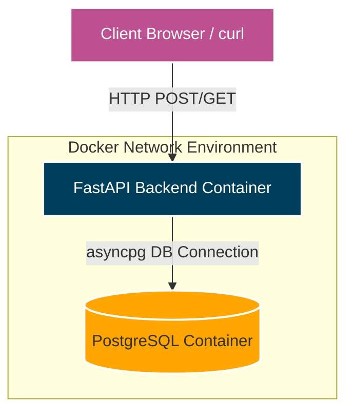
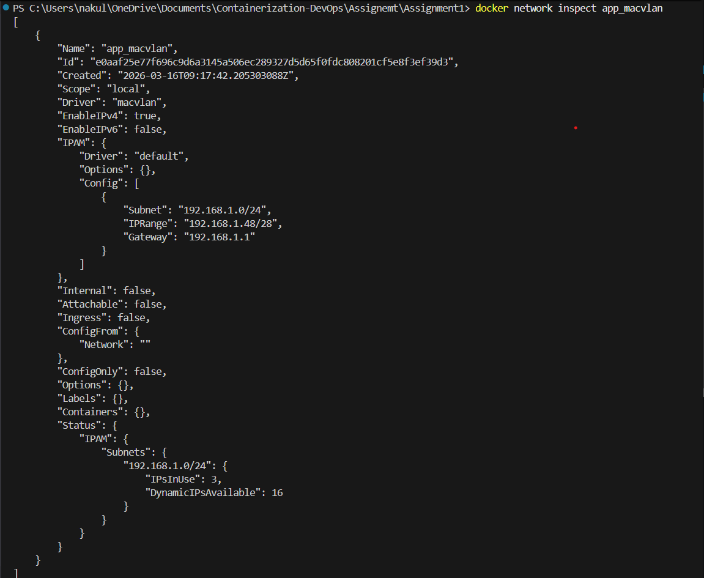
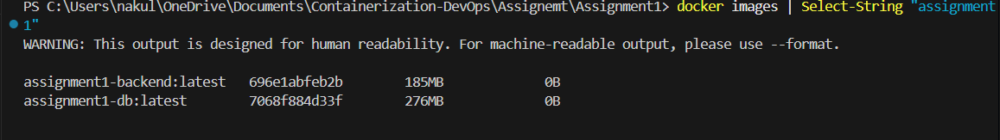
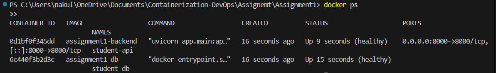
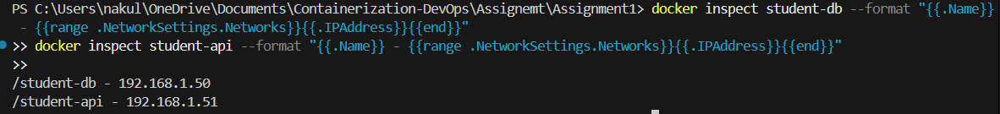
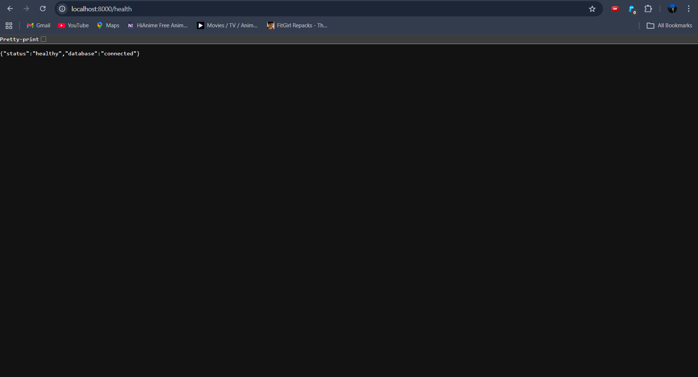
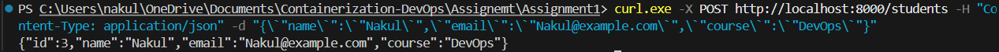
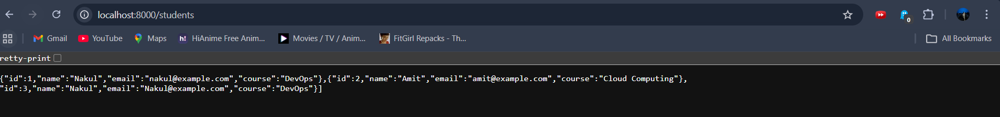
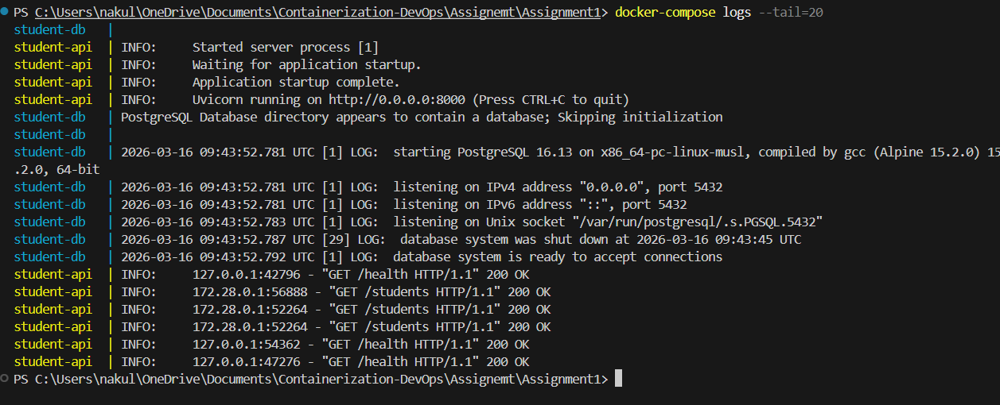
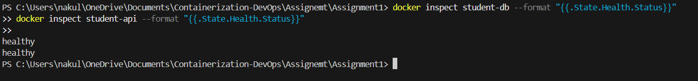

# Assignment 1: Containerized Web Application with PostgreSQL

## 1. Project Overview
This project demonstrates the containerization and deployment of a web application using Docker, Docker Compose, and Macvlan networking. It features a FastAPI backend and a PostgreSQL database.

## 2. Architecture Diagram



---

## 3. Source Code Files

### `docker-compose.yml`
```yaml
services:
  backend:
    build:
      context: ./backend
      dockerfile: Dockerfile
    container_name: student-api
    restart: unless-stopped
    ports:
      - "8000:8000"
    environment:
      - DB_HOST=student-db
      - DB_PORT=5432
      - DB_NAME=${POSTGRES_DB:-appdb}
      - DB_USER=${POSTGRES_USER:-appuser}
      - DB_PASSWORD=${POSTGRES_PASSWORD:-apppassword}
    networks:
      app_net:
        ipv4_address: 172.28.0.3
    depends_on:
      db:
        condition: service_healthy
    healthcheck:
      test: ["CMD", "curl", "-f", "http://localhost:8000/health"]
      interval: 30s
      timeout: 10s
      start_period: 15s
      retries: 3

  db:
    build:
      context: ./database
      dockerfile: Dockerfile
    container_name: student-db
    restart: unless-stopped
    environment:
      - POSTGRES_DB=${POSTGRES_DB:-appdb}
      - POSTGRES_USER=${POSTGRES_USER:-appuser}
      - POSTGRES_PASSWORD=${POSTGRES_PASSWORD:-apppassword}
    volumes:
      - pgdata:/var/lib/postgresql/data
    networks:
      app_net:
        ipv4_address: 172.28.0.2
    healthcheck:
      test: ["CMD-SHELL", "pg_isready -U appuser -d appdb"]
      interval: 30s
      timeout: 10s
      start_period: 30s
      retries: 5

volumes:
  pgdata:
    driver: local

networks:
  app_net:
    driver: bridge
    ipam:
      config:
        - subnet: 172.28.0.0/16
          gateway: 172.28.0.1
```

### `backend/Dockerfile`
```dockerfile
# ─── Stage 1: Builder
FROM python:3.12-slim AS builder
WORKDIR /build
RUN apt-get update && apt-get install -y --no-install-recommends gcc libpq-dev && rm -rf /var/lib/apt/lists/*
COPY requirements.txt .
RUN pip install --no-cache-dir --prefix=/install -r requirements.txt

# ─── Stage 2: Runtime
FROM python:3.12-slim AS runtime
LABEL maintainer="nakul"
WORKDIR /app
RUN apt-get update && apt-get install -y --no-install-recommends libpq5 curl && rm -rf /var/lib/apt/lists/*
COPY --from=builder /install /usr/local
RUN groupadd -r appuser && useradd -r -g appuser -d /app -s /sbin/nologin appuser
COPY ./app ./app
USER appuser
EXPOSE 8000
HEALTHCHECK --interval=30s --timeout=10s --start-period=10s --retries=3 \
    CMD curl -f http://localhost:8000/health || exit 1
CMD ["uvicorn", "app.main:app", "--host", "0.0.0.0", "--port", "8000"]
```

### `database/Dockerfile`
```dockerfile
# ─── Stage 1: Builder
FROM postgres:16-alpine AS builder
COPY init.sql /docker-entrypoint-initdb.d/

# ─── Stage 2: Runtime
FROM postgres:16-alpine AS runtime
LABEL maintainer="nakul"
COPY --from=builder /docker-entrypoint-initdb.d/ /docker-entrypoint-initdb.d/
ENV POSTGRES_DB=appdb POSTGRES_USER=appuser POSTGRES_PASSWORD=apppassword
VOLUME ["/var/lib/postgresql/data"]
EXPOSE 5432
HEALTHCHECK --interval=30s --timeout=10s --start-period=30s --retries=5 \
    CMD pg_isready -U $POSTGRES_USER -d $POSTGRES_DB || exit 1
```

### `backend/app/main.py`
```python
import os
from contextlib import asynccontextmanager
from fastapi import FastAPI, HTTPException
from pydantic import BaseModel
import asyncpg

DB_HOST = os.getenv("DB_HOST", "db")
DATABASE_URL = f"postgresql://{os.getenv('DB_USER')}:{os.getenv('DB_PASSWORD')}@{DB_HOST}:5432/{os.getenv('DB_NAME')}"
pool: asyncpg.Pool = None

class StudentCreate(BaseModel):
    name: str; email: str; course: str

class StudentResponse(BaseModel):
    id: int; name: str; email: str; course: str

@asynccontextmanager
async def lifespan(app: FastAPI):
    global pool
    pool = await asyncpg.create_pool(DATABASE_URL, min_size=2, max_size=10)
    async with pool.acquire() as conn:
        await conn.execute("""
            CREATE TABLE IF NOT EXISTS students (
                id SERIAL PRIMARY KEY, name VARCHAR(100) NOT NULL,
                email VARCHAR(150) NOT NULL UNIQUE, course VARCHAR(100) NOT NULL
            );
        """)
    yield
    await pool.close()

app = FastAPI(lifespan=lifespan)

@app.get("/health")
async def healthcheck():
    try:
        async with pool.acquire() as conn:
            await conn.fetchval("SELECT 1")
        return {"status": "healthy", "database": "connected"}
    except Exception as e:
        raise HTTPException(status_code=503, detail=str(e))

@app.post("/students")
async def create_student(student: StudentCreate):
    try:
        async with pool.acquire() as conn:
            row = await conn.fetchrow(
                "INSERT INTO students (name, email, course) VALUES ($1,$2,$3) RETURNING id, name, email, course",
                student.name, student.email, student.course
            )
        return dict(row)
    except Exception as e:
        raise HTTPException(status_code=500, detail=str(e))

@app.get("/students")
async def get_students():
    async with pool.acquire() as conn:
        rows = await conn.fetch("SELECT id, name, email, course FROM students ORDER BY id")
    return [dict(r) for r in rows]
```

---

## 4. Setup Instructions & Proofs

### Step 1: Create Macvlan Network
```bash
docker network create -d macvlan --subnet=192.168.1.0/24 --gateway=192.168.1.1 --ip-range=192.168.1.48/28 app_macvlan
```


### Step 2: Build the Docker Images
```bash
docker-compose build
docker images | findstr "assignment1"
```


### Step 3: Start the Components
```bash
docker-compose up -d
docker ps
```


### Step 4: Verify Container IPs
```bash
docker inspect student-db --format "{{.Name}} - {{range .NetworkSettings.Networks}}{{.IPAddress}}{{end}}"
docker inspect student-api --format "{{.Name}} - {{range .NetworkSettings.Networks}}{{.IPAddress}}{{end}}"
```


### Step 5: Test API & DB Health
```bash
curl http://localhost:8000/health
```


### Step 6: Test Data Insertion (POST)
```bash
curl -X POST http://localhost:8000/students -H "Content-Type: application/json" -d "{\"name\":\"Rahul\",\"email\":\"rahul@example.com\",\"course\":\"DevOps\"}"
```


### Step 7: Test Data Retrieval (GET)
```bash
curl http://localhost:8000/students
```


### Step 8: Verify Volume Persistence
```bash
docker-compose down
docker-compose up -d
curl http://localhost:8000/students
```


### Step 9: Verify Container Logs
```bash
docker-compose logs --tail=20
```


### Step 10: Verify Built-in Healthchecks
```bash
docker inspect student-db --format "{{.State.Health.Status}}"
docker inspect student-api --format "{{.State.Health.Status}}"
```


---

## 5. Technical Explanations

### Build Optimization Discussion
Both Dockerfiles utilize **multi-stage builds** to heavily reduce the final image size:
1. **Builder Stage**: Installs heavy compilation dependencies (`gcc`, full `libpq-dev`), builds Python packages/wheels, and prepares the environment.
2. **Runtime Stage**: Copies over *only* the compiled artifacts (`/install` folder) and necessary runtime libraries. 

This completely removes build tools, cached package indexes, and unnecessary software from the final production image, resulting in a significantly smaller attack surface and much lower storage usage. Furthermore, using `python:3.12-slim` and `postgres:16-alpine` provides minimal base images compared to their full OS counterparts.

### Macvlan vs Ipvlan Comparison

| Feature | Macvlan | Ipvlan |
|---------|---------|--------|
| **Core Concept** | Assigns a unique MAC address to every container, making them look like distinct physical devices on the switch. | Containers share the host's MAC address but get distinct IP addresses. |
| **Switch Compatibility** | Some physical switches/cloud providers block multiple MAC addresses per port (promiscuous mode required). | Better compatibility because the switch only sees the host's MAC address. |
| **Broadcasts** | Receives broadcast/multicast traffic from the physical network. | Does not process broadcast/multicast (L3 mode). |
| **Best Use Case** | Legacy apps requiring a true physical network presence and their own MAC. | Modern scalable setups where switch port security blocks multiple MACs. |

### Host Isolation Issue (Macvlan)
A strict security limitation in the Linux kernel prevents the host machine from directly pinging or communicating with its own Macvlan containers using their assigned IPs. To bypass this, a "macvlan shim interface" must be created on the host itself, acting as a bridge to allow traffic between the host OS and the macvlan network space.

### Network Design Details
- The DB is given static IP `192.168.1.50`.
- The Backend is given static IP `192.168.1.51`.
- Docker Compose natively orchestrates the static IP assignment within the `app_macvlan` pool (`192.168.1.48/28`).
- Postgres volume uses a named volume `pgdata` to ensure data persists across container removal.
