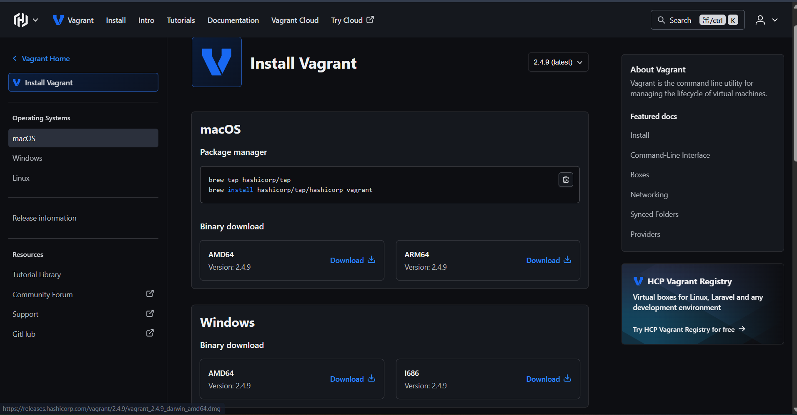
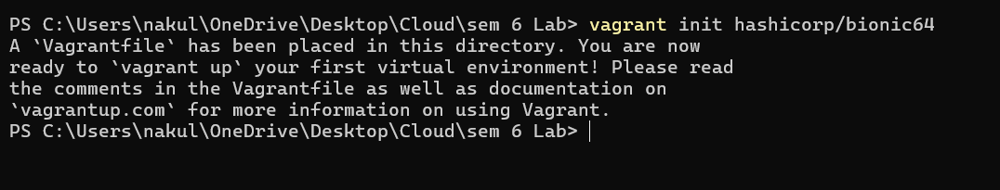
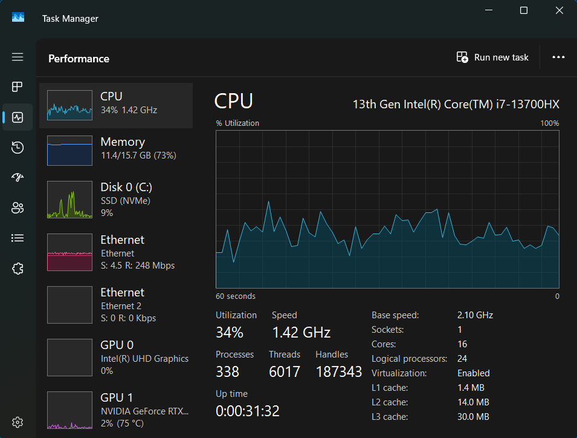

#  Lab Experiment 1 -- Comparison of Virtual Machines and Containers

##  Objective

-   Understand differences between Virtual Machines and Containers.
-   Install and configure VM using VirtualBox and Vagrant.
-   Install and configure Containers using Docker on WSL.
-   Deploy Nginx web server in both environments.
-   Observe system resource utilization.

##  Tools Used

-   VirtualBox
-   Vagrant
-   Ubuntu
-   WSL
-   Docker
-   Nginx
-   VS Code

------------------------------------------------------------------------

#  Part A -- Virtual Machine Setup

### Step 1 -- Download VirtualBox


### Step 2 -- Install Vagrant



### Step 3 -- Initialize Vagrant

``` bash
vagrant init hashicorp/bionic64
```



### Step 4 -- Start VM

``` bash
vagrant up
```


### Step 5 -- VM Created


### Step 6 -- VM Running


### Step 7 -- SSH into VM

``` bash
vagrant ssh
```


### Step 8 -- Start Nginx in VM

``` bash
sudo systemctl start nginx
```


### Step 9 -- Verify Nginx

``` bash
curl localhost
```


### Step 10 -- Virtualization Enabled



------------------------------------------------------------------------

#  Part B -- Docker Container Setup

### Step 1 -- Open WSL


### Step 2 -- Run Docker Nginx

``` bash
docker run -d -p 8080:80 --name nginx-container nginx
```


### Step 3 -- Verify Container Output

``` bash
curl localhost:8080
```


### Step 4 -- Monitor using htop

``` bash
htop
```


### Step 5 -- Check Memory

``` bash
free -h
```


### Step 6 -- System Analyze

``` bash
systemd-analyze
```


### Step 7 -- Docker Stats

``` bash
docker stats
```


------------------------------------------------------------------------

## Result

Successfully compared VM and Container performance.
