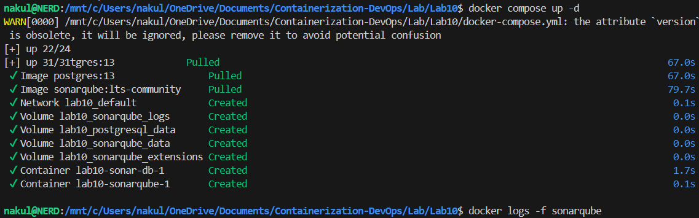
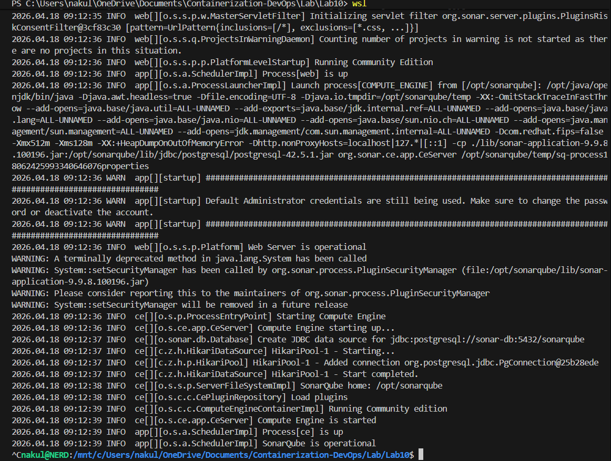
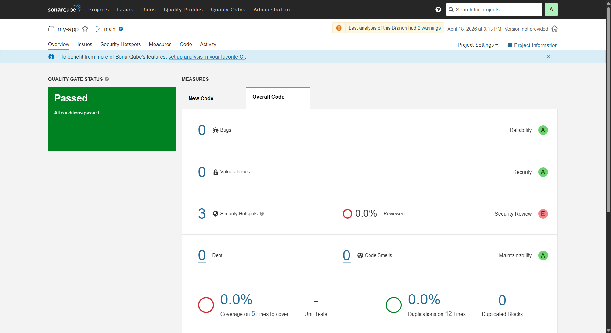
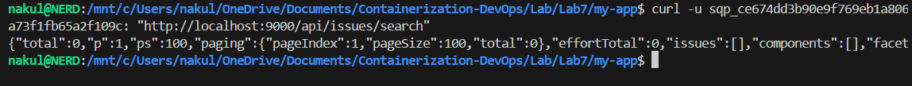
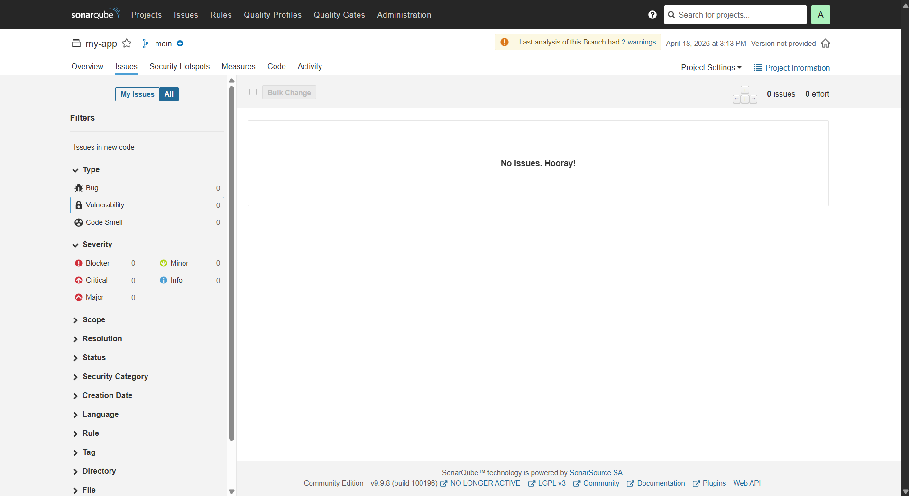

# Experiment 10: SonarQube – Static Code Analysis

## 1. Aim
To analyze code quality using SonarQube and integrate it into a CI/CD pipeline.

## 2. Problem Statement
- Bugs found late
- Manual code review is slow
- Hard to maintain quality

## 3. What is SonarQube?
SonarQube is a tool that:
- Scans code
- Finds bugs
- Detects security issues
- Improves maintainability

👉 It uses **static analysis** (no execution required)

## 4. What Problems It Solves
- Detects issues early
- Ensures code quality
- Tracks technical debt
- Enforces quality rules

## 5. Key Terms (VERY IMPORTANT)
| Term | Meaning |
|---|---|
| Bug | Code that may fail |
| Vulnerability | Security risk |
| Code Smell | Bad coding practice |
| Quality Gate | Pass/fail check |
| Technical Debt | Effort to fix issues |
| Coverage | Tested code % |
| Duplication | Repeated code |

## 6. Architecture (VERY IMPORTANT)
According to the diagram:
**Code → Scanner → SonarQube Server → Database → Dashboard**

### Components
1. **SonarQube Server (Brain)**: Runs on port 9000, stores results, shows dashboard.
2. **Sonar Scanner (Worker)**: Reads code, finds issues, sends report.
3. **PostgreSQL**: Stores analysis data.

## 7. Important Concept
👉 Both are required:
| Setup | Result |
|---|---|
| Only Server | No analysis |
| Only Scanner | No storage |
| **Both** | **Works** |

## 8. Token Authentication (IMPORTANT)
**Flow:**
Generate Token → Pass to Scanner → Server verifies → Stores results
👉 Token = secure login (not password)

---

## 9. Step-by-Step Flow

### Step 1: Start SonarQube Server
We start SonarQube and PostgreSQL.

```bash
docker-compose up -d
docker logs -f sonarqube
```
Open: http://localhost:9000

### Terminal Output


---

### Step 2: Sample Code & Run Scanner
First, ensure you have some code with bugs (Division by zero, SQL injection, unused variables). Then run the scanner against your code using the token generated from SonarQube.

**Option 1: Maven**
```bash
mvn sonar:sonar -Dsonar.login=YOUR_TOKEN
```
**Option 2: CLI (Docker)**
```bash
docker run -e SONAR_HOST_URL="http://localhost:9000" -e SONAR_LOGIN="YOUR_TOKEN" -v "${PWD}:/usr/src" sonarsource/sonar-scanner-cli
```

### Terminal Output


---

### Step 3: View Dashboard Results
Open: http://localhost:9000
You’ll see: Bugs, Vulnerabilities, Code Smells, Quality Gate.

**Example Dashboard:**
- Bugs: 5
- Vulnerabilities: 1
- Code Smells: 8
- Quality Gate: FAILED

### Terminal Output


---

### Step 4: Automating via API
You can query issues programmatically using the SonarQube API.
```bash
curl -u admin:YOUR_TOKEN "http://localhost:9000/api/issues/search"
```

### Terminal Output


---

### Step 5: Jenkins Pipeline Integration
**Pipeline Flow:** Checkout → Scan → Build → Deploy

We updated the `Jenkinsfile` from **Lab 7** to include a new stage for SonarQube. This ties both labs together! 

**Important Code Snippet added to Lab 7 Jenkinsfile:**
```groovy
        stage('SonarQube Analysis') {
            steps {
                sh 'docker run --rm -v "${WORKSPACE}:/usr/src" sonarsource/sonar-scanner-cli -D"sonar.projectKey=Angel0606" -D"sonar.sources=." -D"sonar.host.url=http://host.docker.internal:9000" -D"sonar.login=sqp_ce674dd3b90e9f769eb1a806a73f1fb65a2f109c"'
            }
        }
```
👉 Jenkins intercepts the code, executes the scanner locally, and visually displays whether the code allowed the pipeline to proceed to Docker Hub!

### Terminal Output


---

## 15. Tool Comparison (Important Theory)
| Tool | Purpose |
|---|---|
| Jenkins | CI/CD |
| SonarQube | Code quality |
| Ansible | Config management |
| Chef | Infra automation |

## 16. Best Practices
- **Security**: Never hardcode tokens, use environment variables.
- **Code Quality**: Fix issues early, use Quality Gates.
- **CI/CD**: Run scan on every commit, fail pipeline on bad code.

## 17. Final Summary
- **SonarQube** = analysis platform
- **Scanner** = analyzes code
- **Token** = secure authentication
- **Quality Gate** = stops bad code

## 🔥 FINAL UNDERSTANDING
**SonarQube** = “System that checks your code quality before it is deployed.”

### Important Insight for YOU
Now your learning stack is:
**Docker → Compose → Kubernetes → Jenkins → SonarQube**
👉 *This is complete DevOps pipeline knowledge!*
