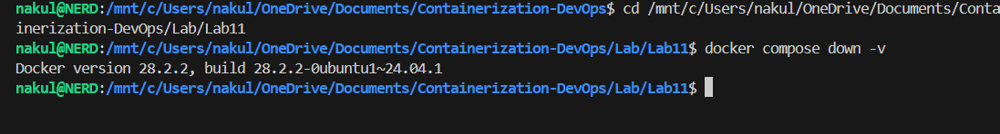
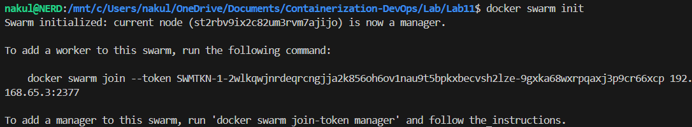
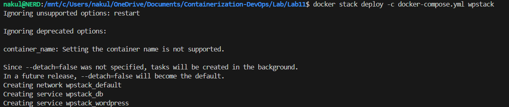
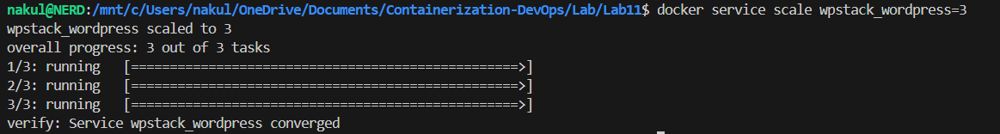
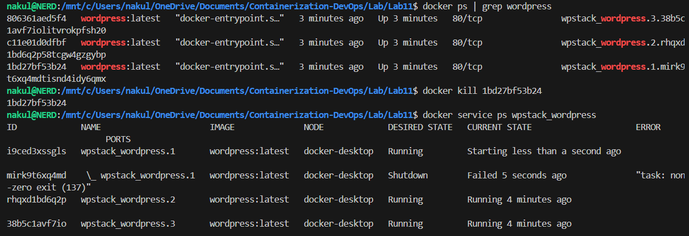

# Experiment 11: Orchestration using Docker Compose & Docker Swarm

## 1. Aim

To orchestrate multi-container applications using Docker Swarm, extending the WordPress + MySQL setup from Experiment 6 with scaling, self-healing, and load balancing.

## 2. Problem Statement

Docker Compose works well for development on a single machine, but it lacks:
- Automatic recovery when containers crash
- Built-in load balancing across replicas
- Multi-host deployment capability

Docker Swarm solves these limitations by adding orchestration on top of Compose.

## 3. Concepts

### The Progression Path

```
docker run  →  Docker Compose  →  Docker Swarm  →  Kubernetes
    │               │                  │                │
 Single         Multi-container    Orchestration    Advanced
 container      (single host)       (basic)        orchestration
```

### What Orchestration Adds

| Feature | What it means |
|---|---|
| Scaling | Increase/decrease number of containers with one command |
| Self-healing | Restart failed containers automatically |
| Load balancing | Distribute traffic across all replicas |
| Multi-host | Run containers across multiple machines |

### Compose vs Swarm

| Feature | Docker Compose | Docker Swarm |
|---|---|---|
| Scope | Single host | Multi-node cluster |
| Scaling | Basic (`--scale`), port conflicts | `docker service scale`, no conflicts |
| Load Balancing | No | Yes (internal LB) |
| Self-Healing | No | Yes (automatic) |
| Rolling Updates | No | Yes (zero downtime) |
| Use Case | Development, testing | Simple production clusters |

---

## 4. Prerequisites

- Docker installed with Swarm mode available
- `docker-compose.yml` from this directory (WordPress + MySQL)

---

## 5. Steps Performed

### Task 1: Check Current State

Navigated to the Lab11 directory and stopped any existing Compose containers:

```bash
cd /mnt/c/Users/nakul/OneDrive/Documents/Containerization-DevOps/Lab/Lab11
docker compose down -v
```

Output confirmed Docker version `28.2.2, build 28.2.2-0ubuntu1~24.04.1` and no containers were running.

**📸 Screenshot:**


---

### Task 2: Initialize Docker Swarm

```bash
docker swarm init
```

Output:
```
Swarm initialized: current node (st2rbv9ix2c82um3rvm7ajijo) is now a manager.

To add a worker to this swarm, run the following command:
    docker swarm join --token SWMTKN-1-2wlkqwjnrdeqrcngjja2k856oh6ov1nau9t5bpkxbecvsh2lze-9gxka68wxrpqaxj3p9cr66xcp 192.168.65.3:2377
```

This machine became the **manager node** of a single-node Swarm cluster.

**📸 Screenshot:**


---

### Task 3: Deploy as a Stack

```bash
docker stack deploy -c docker-compose.yml wpstack
```

Output:
```
Ignoring unsupported options: restart
Ignoring deprecated options:
container_name: Setting the container name is not supported.

Creating network wpstack_default
Creating service wpstack_db
Creating service wpstack_wordpress
```

> **Note:** Swarm ignored `restart` and `container_name` from the Compose file — these are Compose-only options. Swarm manages restarts automatically through its own service policies.

**📸 Screenshot:**


---

### Task 4: Scale the Application

Scaled WordPress from 1 to 3 replicas:

```bash
docker service scale wpstack_wordpress=3
```

Output:
```
wpstack_wordpress scaled to 3
overall progress: 3 out of 3 tasks
1/3: running
2/3: running
3/3: running
verify: Service wpstack_wordpress converged
```

All 3 replicas started and Swarm confirmed convergence.

**📸 Screenshot:**


> **How 3 containers share port 8080:** Swarm's internal load balancer listens on port 8080 once and distributes traffic to all 3 containers — no port conflicts.

---

### Task 5: Test Self-Healing

**Step 1:** Listed all WordPress containers:
```bash
docker ps | grep wordpress
```

Three containers were running:
- `wpstack_wordpress.3` — ID `38b5c1avf7io`
- `wpstack_wordpress.2` — ID `rhqxd1bd6q2p`
- `wpstack_wordpress.1` — ID `1bd27bf53b24`

**Step 2:** Killed one container to simulate a crash:
```bash
docker kill 1bd27bf53b24
```

**Step 3:** Checked service status:
```bash
docker service ps wpstack_wordpress
```

Output showed:
- `wpstack_wordpress.1` → **Starting** (new container being created)
- Old `wpstack_wordpress.1` (mirk9...) → **Shutdown / Failed** `"task: non-zero exit (137)"`
- `wpstack_wordpress.2` → **Running** (unaffected)
- `wpstack_wordpress.3` → **Running** (unaffected)

Swarm automatically replaced the killed container. Total replicas remained = 3 with **no manual intervention**.

**📸 Screenshot:**


---

### Task 6: Remove the Stack

```bash
docker stack rm wpstack
```

Output:
```
Removing service wpstack_db
Removing service wpstack_wordpress
Removing network wpstack_default
```

Both services and the overlay network were removed cleanly.

**📸 Screenshot:**


---

## 6. Key Observations

### Observation 1: Compose File Reuse
The **same YAML file** works for both Compose and Swarm:

| Command | Mode |
|---|---|
| `docker compose up -d` | Compose (single host, no orchestration) |
| `docker stack deploy` | Swarm (orchestration enabled) |

Swarm silently ignores Compose-only options like `restart` and `container_name`.

### Observation 2: Containers vs Services

| Concept | Meaning |
|---|---|
| Container | A single running instance |
| Service | A definition of how to run containers (image, replicas, etc.) |

In Swarm, you manage **services**, not individual containers.

### Observation 3: The Port Mystery Solved
In plain Compose, scaling WordPress to 3 would **fail** (port 8080 conflict). In Swarm, the load balancer listens on port 8080 **once** and routes traffic internally — no conflicts.

---

## 7. Quick Reference

```bash
# Initialize Swarm
docker swarm init

# Deploy stack
docker stack deploy -c docker-compose.yml <stack-name>

# List services
docker service ls

# Scale service
docker service scale <stack_service>=<replicas>

# See service tasks
docker service ps <service-name>

# Remove stack
docker stack rm <stack-name>

# Leave Swarm
docker swarm leave --force
```

---

## 8. Result

- Successfully initialized Docker Swarm on a single-node cluster (node ID: `st2rbv9ix2c82um3rvm7ajijo`).
- Deployed the WordPress + MySQL stack using `docker stack deploy -c docker-compose.yml wpstack`.
- Scaled WordPress to 3 replicas — Swarm handled load balancing automatically with `verify: Service wpstack_wordpress converged`.
- Demonstrated self-healing: killed container `1bd27bf53b24`, Swarm recreated `wpstack_wordpress.1` automatically without any manual intervention.
- Cleaned up the stack with `docker stack rm wpstack`.

---

## 9. Navigation

- [← Lab 10 — SonarQube](../Lab10/README.md)
- [→ Lab 12](../Lab12/README.md)
- [All Labs](../../README.md)
