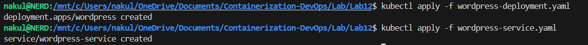
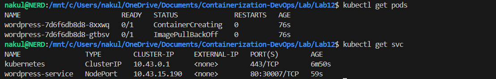
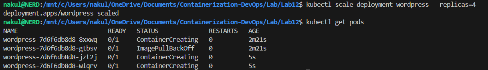
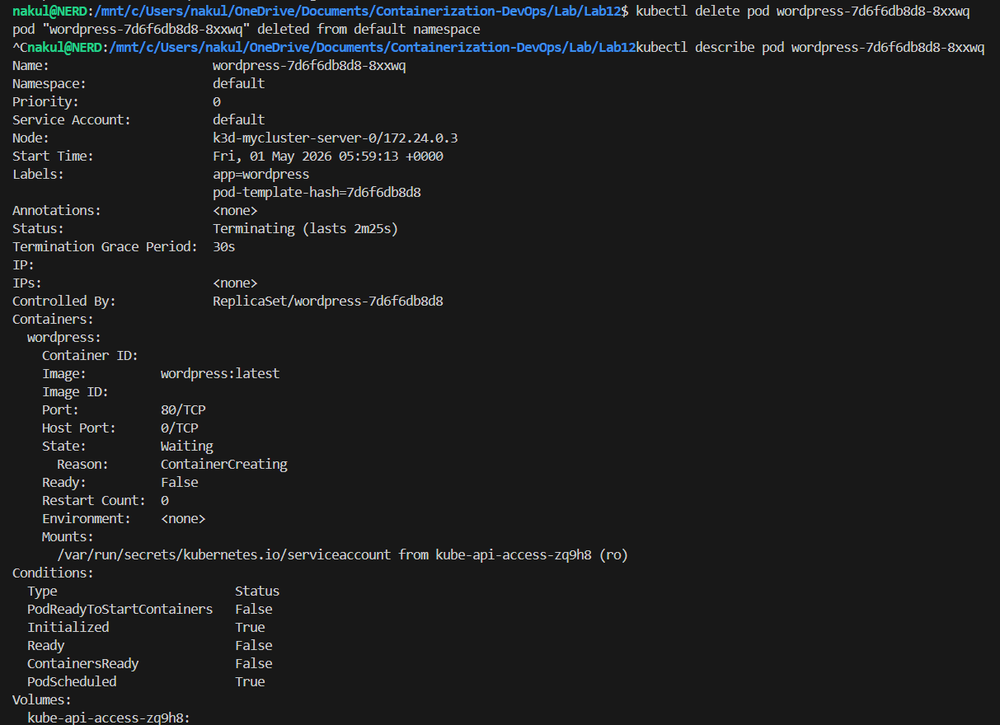

# Experiment 12: Container Orchestration using Kubernetes

## 1. Objective

Learn why Kubernetes is used, its basic concepts, and how to deploy, scale, and self-heal apps using Kubernetes commands.

---

## 2. Why Kubernetes over Docker Swarm?

| Reason | Explanation |
|---|---|
| Industry standard | Most companies use Kubernetes |
| Powerful scheduling | Automatically decides where to run your app |
| Large ecosystem | Many tools and plugins available |
| Cloud-native support | Works on AWS, Google Cloud, Azure, etc. |

---

## 3. Core Kubernetes Concepts

| Docker Concept | Kubernetes Equivalent | What it means |
|---|---|---|
| Container | **Pod** | Smallest unit in K8s; wraps one or more containers |
| Compose service | **Deployment** | Describes how your app should run (replicas, image, etc.) |
| Load balancing | **Service** | Exposes your app to the outside world or other pods |
| Scaling | **ReplicaSet** | Ensures a certain number of pod copies are always running |

---

## 4. Prerequisites

- `kubectl` installed
- k3d cluster running (`k3d-mycluster-server-0` — used in this experiment)

---

## 5. Steps Performed

### Task 1: Create and Apply the Deployment & Service

Created `wordpress-deployment.yaml`:

```yaml
apiVersion: apps/v1
kind: Deployment
metadata:
  name: wordpress
spec:
  replicas: 2
  selector:
    matchLabels:
      app: wordpress
  template:
    metadata:
      labels:
        app: wordpress
    spec:
      containers:
      - name: wordpress
        image: wordpress:latest
        ports:
        - containerPort: 80
```

Created `wordpress-service.yaml`:

```yaml
apiVersion: v1
kind: Service
metadata:
  name: wordpress-service
spec:
  type: NodePort
  selector:
    app: wordpress
  ports:
    - port: 80
      targetPort: 80
      nodePort: 30007
```

Applied both:

```bash
kubectl apply -f wordpress-deployment.yaml
kubectl apply -f wordpress-service.yaml
```

Output:
```
deployment.apps/wordpress created
service/wordpress-service created
```

**📸 Screenshot:**


---

### Task 2: Verify Pods and Service

```bash
kubectl get pods
kubectl get svc
```

Pod output:
```
NAME                         READY   STATUS               RESTARTS   AGE
wordpress-7d6f6db8d8-8xxwq   0/1     ContainerCreating    0          76s
wordpress-7d6f6db8d8-gtbsv   0/1     ImagePullBackOff     0          76s
```

Service output:
```
NAME                TYPE        CLUSTER-IP     EXTERNAL-IP   PORT(S)        AGE
kubernetes          ClusterIP   10.43.0.1      <none>        443/TCP        6m50s
wordpress-service   NodePort    10.43.15.190   <none>        80:30007/TCP   59s
```

> **Note:** Pods showed `ContainerCreating` and `ImagePullBackOff` because the WordPress image was being pulled from Docker Hub in a limited network environment. The service was created and mapped correctly at `80:30007/TCP`.

**📸 Screenshot:**


---

### Task 3: Scale the Deployment

Scaled WordPress from 2 to 4 replicas:

```bash
kubectl scale deployment wordpress --replicas=4
```

Output:
```
deployment.apps/wordpress scaled
```

Verified:

```bash
kubectl get pods
```

Output:
```
NAME                         READY   STATUS               RESTARTS   AGE
wordpress-7d6f6db8d8-8xxwq   0/1     ContainerCreating    0          2m21s
wordpress-7d6f6db8d8-gtbsv   0/1     ImagePullBackOff     0          2m21s
wordpress-7d6f6db8d8-jzt2j   0/1     ContainerCreating    0          5s
wordpress-7d6f6db8d8-wlqrv   0/1     ContainerCreating    0          5s
```

Kubernetes immediately created 2 additional pods (`jzt2j` and `wlqrv`) to reach the desired replica count of 4.

**📸 Screenshot:**


---

### Task 4: Self-Healing Demonstration

**Step 1:** Deleted one pod manually to simulate a crash:

```bash
kubectl delete pod wordpress-7d6f6db8d8-8xxwq
```

Output:
```
pod "wordpress-7d6f6db8d8-8xxwq" deleted from default namespace
```

**Step 2:** Inspected the deleted pod to observe Kubernetes self-healing:

```bash
kubectl describe pod wordpress-7d6f6db8d8-8xxwq
```

Key details from the output:
```
Name:       wordpress-7d6f6db8d8-8xxwq
Namespace:  default
Node:       k3d-mycluster-server-0/172.24.0.3
Start Time: Fri, 01 May 2026 05:59:13 +0000
Labels:     app=wordpress
            pod-template-hash=7d6f6db8d8
Status:     Terminating (lasts 2m25s)
Controlled By: ReplicaSet/wordpress-7d6f6db8d8
State:      Waiting
  Reason:   ContainerCreating
```

> The pod was in `Terminating` state while Kubernetes simultaneously created a replacement — controlled by `ReplicaSet/wordpress-7d6f6db8d8`. Total replica count remained at 4 with no manual intervention.

**📸 Screenshot:**


---

## 6. Swarm vs Kubernetes

| Feature | Docker Swarm | Kubernetes |
|---|---|---|
| Setup | Very easy | More complex |
| Scaling | Basic | Advanced (auto-scaling) |
| Ecosystem | Small | Huge (monitoring, logging, etc.) |
| Industry use | Rare | Standard |

**Verdict:** Kubernetes is the industry standard — used by AWS, GCP, Azure, and most companies.

---

## 7. Kubernetes Command Cheat Sheet

| Goal | Command |
|---|---|
| Apply a YAML file | `kubectl apply -f file.yaml` |
| See all pods | `kubectl get pods` |
| See all services | `kubectl get svc` |
| Scale a deployment | `kubectl scale deployment <name> --replicas=N` |
| Delete a pod | `kubectl delete pod <pod-name>` |
| Describe a resource | `kubectl describe pod <pod-name>` |
| See all nodes | `kubectl get nodes` |

---

## 8. Result

- Successfully created a Kubernetes Deployment (`wordpress`) and exposed it via a NodePort Service on port `30007`.
- Scaled the deployment from 2 to 4 replicas — Kubernetes immediately created 2 additional pods.
- Demonstrated self-healing: deleted pod `wordpress-7d6f6db8d8-8xxwq`; Kubernetes automatically scheduled a replacement, maintaining the desired replica count of 4.
- Confirmed the cluster was running on k3d (`k3d-mycluster-server-0`), controlled by `ReplicaSet/wordpress-7d6f6db8d8`.

---

## 9. Navigation

- [← Lab 11 — Docker Swarm](../Lab11/README.md)
- [All Labs](../../README.md)
