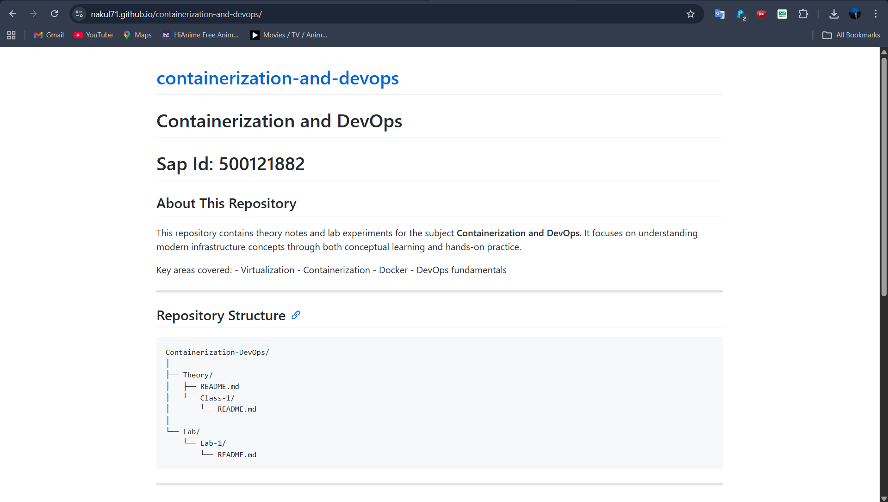

# Installing Docker on Windows & Making GitHub.io Live

This project documents the complete setup process for:

-   Installing and configuring Docker on Windows
-   Running containers and testing the environment
-   Hosting a static website using GitHub Pages

It serves as a beginner-friendly guide to containerization and basic web
deployment.

------------------------------------------------------------------------

# Part 1: Installing Docker on Windows

Docker allows applications to run inside lightweight, portable
containers.

## Step 1: Install Docker Desktop for Windows

1.  Visit the official Docker website:\
    https://www.docker.com/products/docker-desktop

2.  Download **Docker Desktop for Windows**

3.  Run the installer (`Docker Desktop Installer.exe`)

4.  During installation:

    -   Enable **WSL 2** if prompted
    -   Keep default settings

5.  Restart your system if required

6.  Open Docker Desktop from the Start Menu

7.  Wait until it shows **Docker is running**

------------------------------------------------------------------------

## Step 2: Verify Docker Installation

Open **Command Prompt** or **PowerShell** and run:

``` bash
docker --version
```

Then run a test container:

``` bash
docker run hello-world
```

If Docker is installed correctly, a confirmation message will be
displayed.

------------------------------------------------------------------------

## Step 3: Run an Ubuntu Container

``` bash
docker run -it ubuntu:22.04 bash
```

This starts an interactive Ubuntu terminal inside a Docker container
where you can execute Linux commands.

------------------------------------------------------------------------

## Step 4: Install Java Inside the Container (Example)

Inside the Ubuntu container:

``` bash
apt update
apt install default-jdk -y
java -version
```

Create a Java file:

``` bash
nano Hello.java
```

Add the following code:

``` java
class Hello {
    public static void main(String[] args) {
        System.out.println("Hello from Docker on Windows!");
    }
}
```

Compile and run:

``` bash
javac Hello.java
java Hello
```

Expected output:

    Hello from Docker on Windows!

------------------------------------------------------------------------

# Part 2: Hosting a Website with GitHub Pages

GitHub Pages allows you to host static websites directly from a GitHub
repository.

------------------------------------------------------------------------

## Step 1: Create a Repository

1.  Go to https://github.com\
2.  Click **New Repository**
3.  Name the repository exactly:

```{=html}
<!-- -->
```
    yourusername.github.io

Replace `yourusername` with your actual GitHub username.

The repository name must match your GitHub username exactly for the site
to work.

------------------------------------------------------------------------

## Step 2: Add Website Files

Upload your website files such as:

-   `index.html`
-   `style.css`
-   `script.js`

Or push your project using Git from your local machine:

``` bash
git init
git add .
git commit -m "Initial website"
git branch -M main
git remote add origin https://github.com/yourusername/yourusername.github.io.git
git push -u origin main
```

------------------------------------------------------------------------

## Step 3: Enable GitHub Pages

1.  Open your repository on GitHub\
2.  Click on **Settings**\
3.  Click **Pages** from the left sidebar\
4.  Under Branch, select:

```{=html}
<!-- -->
```
    Branch: main
    Folder: /root

5.  Click **Save**

------------------------------------------------------------------------

## Step 4: Access the Live Website

After a few minutes, your website will be live at:

    https://yourusername.github.io

If the site does not appear immediately, wait a few minutes and refresh
the page.

------------------------------------------------------------------------

## Screenshot (Example)


