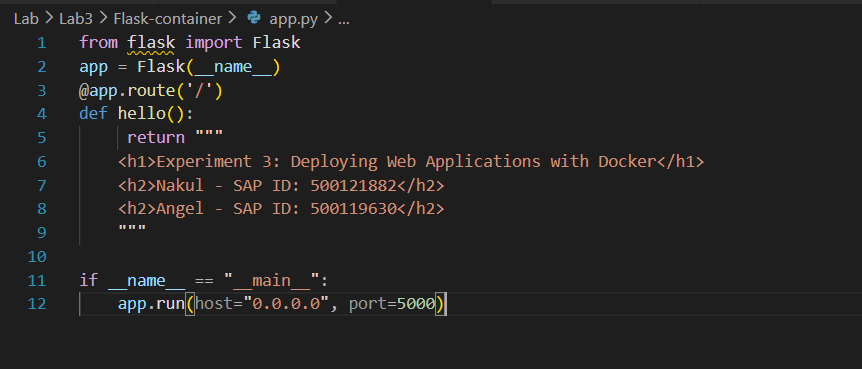
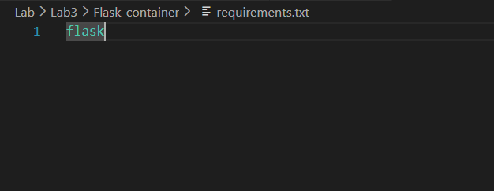
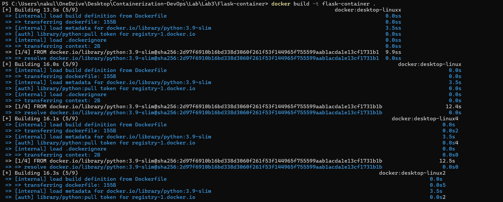
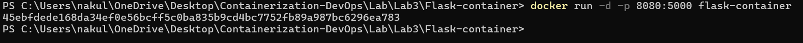
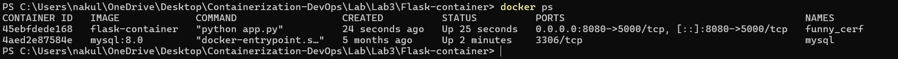
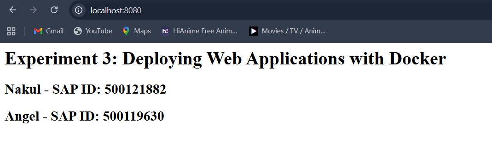

# Experiment 3: Deploying Web Applications with Docker

## Objective

This experiment demonstrates how to containerize a Python Flask web
application.\
The process includes writing a Dockerfile, building a container image,
and mapping ports to access the application from a local browser.

------------------------------------------------------------------------

## Project Structure

The project directory **Flask-container** contains the following
essential files:

-   app.py\
-   requirements.txt\
-   Dockerfile

------------------------------------------------------------------------

## Procedure

### Step 1: Create the Flask Application (app.py)

Below is the screenshot of the Flask application code:

------------------------------------------------------------------------

### Step 2: Define Dependencies (requirements.txt)

Screenshot of the requirements file:

------------------------------------------------------------------------

### Step 3: Create the Dockerfile

Screenshot of the Dockerfile configuration:

------------------------------------------------------------------------

### Step 4: Build the Docker Image

Screenshot of the Docker build process:

------------------------------------------------------------------------

### Step 5: Run the Docker Container

Screenshot of the docker run command:

------------------------------------------------------------------------

### Step 6: Verify the Running Container

Screenshot of the docker ps output:

------------------------------------------------------------------------

### Step 7: Access the Web Application

Screenshot of the web application running in the browser:

------------------------------------------------------------------------

## Result

The Flask web application was successfully containerized and deployed.\
The screenshots above demonstrate each step from writing the application
code to running the container and accessing it via the browser.

------------------------------------------------------------------------

## Conclusion

Docker simplifies the deployment process by bundling the application
with its runtime environment.\
This ensures consistent execution across different systems and
eliminates environment-related issues.
