# Lab 3 – Docker Images and Custom NGINX (Part 1)

## Objective

- To pull and run official NGINX image  
- To verify containerized web server in browser  
- To build a custom NGINX image using Ubuntu  
- To build a lightweight NGINX image using Alpine  
- To compare image sizes  
- To deploy custom HTML using bind mount  

---

## Environment Used

- Host OS: Windows 11  
- Docker Desktop  
- PowerShell Terminal  
- Web Browser (Chrome)  

---

# Part A – Running Official NGINX Image

## Step 1 – Pull NGINX Image

```bash
docker pull nginx
```

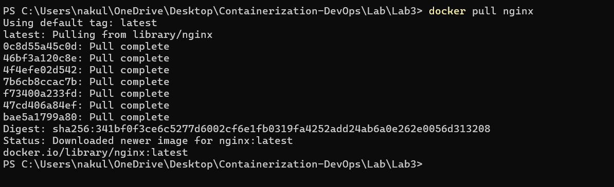

---

## Step 2 – Run NGINX Container

```bash
docker run -d --name nginx-official -p 8080:80 nginx
```


---

## Step 3 – Verify in Browser

Open:

http://localhost:8080

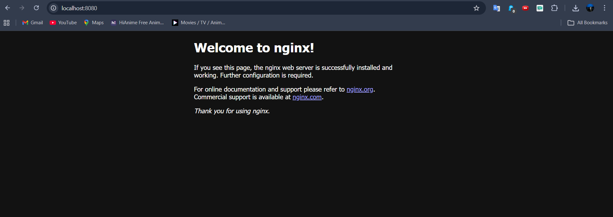

---

## Step 4 – Check Image Details

```bash
docker images nginx
```

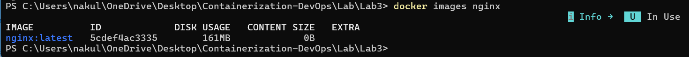

---

# Part B – Custom NGINX using Ubuntu Base

(Folder: Part1)

## Step 5 – Dockerfile (Ubuntu Based)

```bash

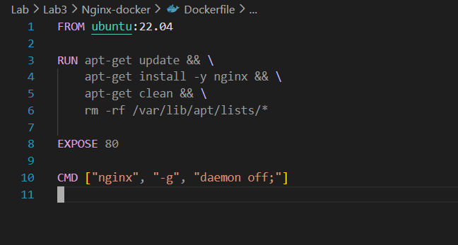

---

## Step 6 – Build Ubuntu-based Image

```bash
docker build -t nginx-ubuntu .
```

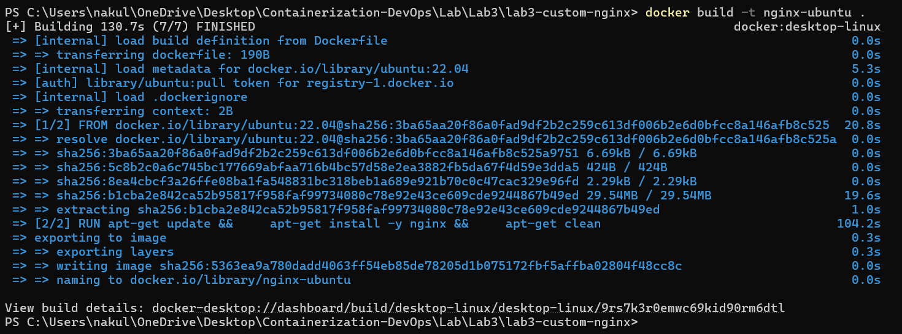

---

## Step 7 – Verify Image Size

```bash
docker images nginx-ubuntu
```

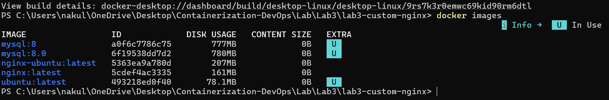

---

# Part C – Lightweight NGINX using Alpine

(Folder: Part2)

## Step 8 – Dockerfile (Alpine Based)

```dockerfile
FROM alpine:latest

RUN apk add --no-cache nginx

EXPOSE 80

CMD ["nginx", "-g", "daemon off;"]
```

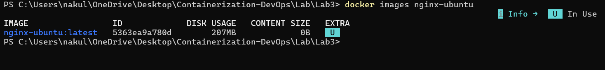

---

## Step 9 – Build Alpine Image

```bash
docker build -t nginx-alpine .
```

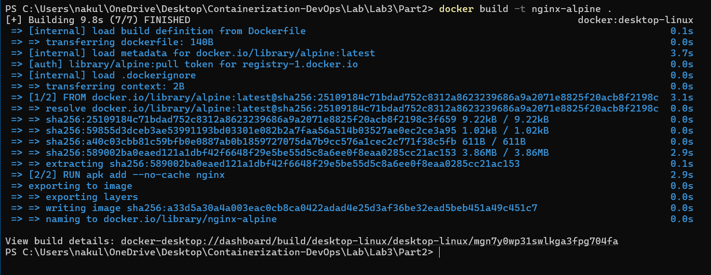

---

## Step 10 – Run Alpine Container

```bash
docker run -d --name nginx-alpine -p 8082:80 nginx-alpine
```

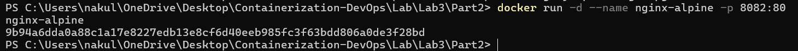

---

## Step 11 – Compare Image Sizes

```bash
docker images | findstr nginx
```

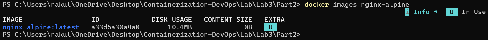

---

# Part D – Custom HTML Deployment using Bind Mount

## Step 12 – Create HTML Directory

```bash
mkdir html
```

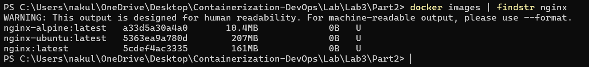

---

## Step 13 – Create Custom Index File

```bash
echo "<h1>Hello from Docker NGINX</h1>" > html/index.html
```

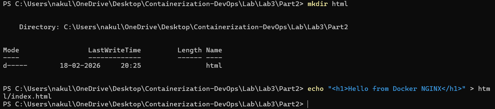

---

## Step 14 – Run Container with Bind Mount

```bash
docker run -d ^
  -p 8083:80 ^
  -v ${PWD}\html:/usr/share/nginx/html ^
  nginx
```

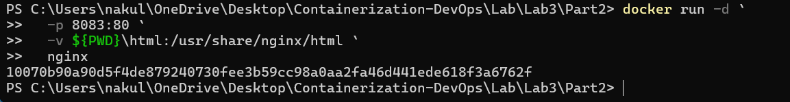

---

## Step 15 – Verify Custom Page in Browser

Open:

http://localhost:8083

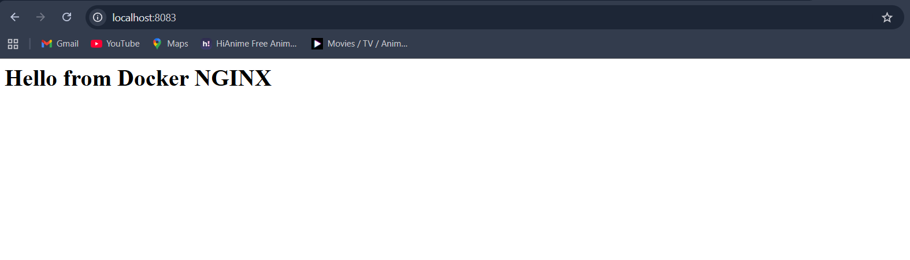

---

# Result (Partial – Continuing Later)

- Official NGINX container deployed
- Ubuntu-based custom image built
- Alpine-based lightweight image built
- Image size comparison completed
- Custom HTML deployed using bind mount

