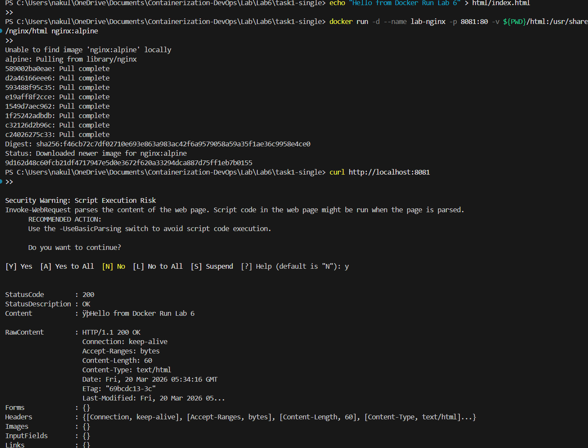
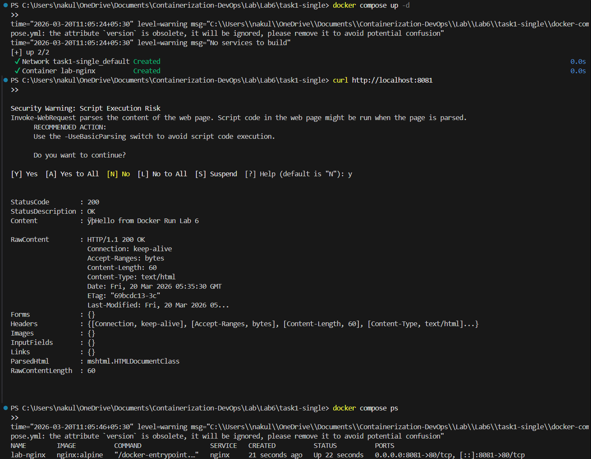
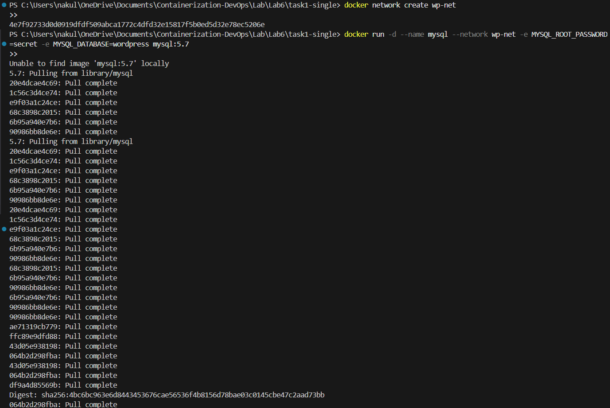
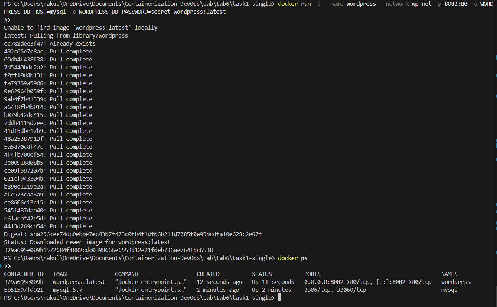
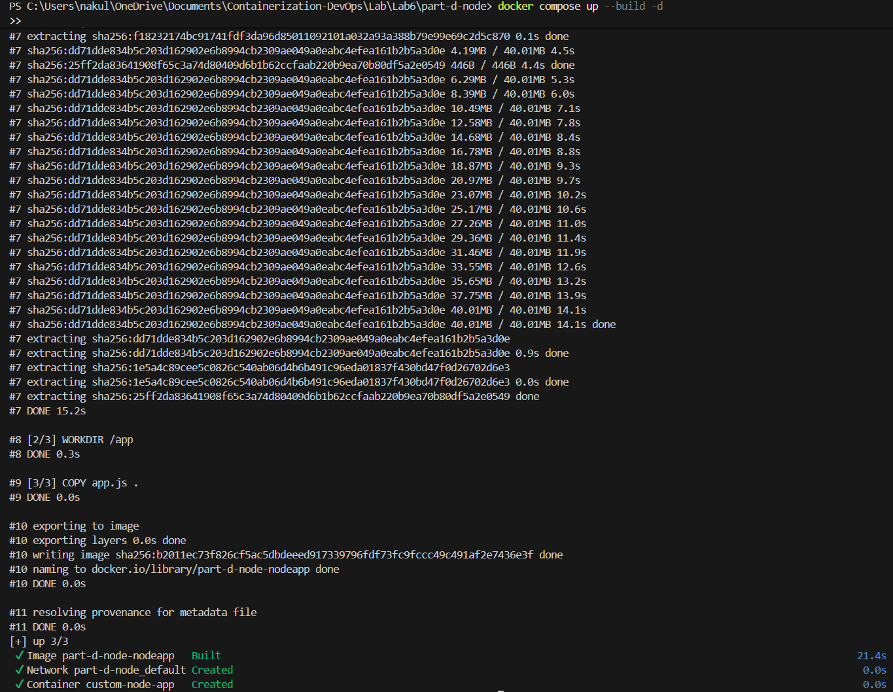
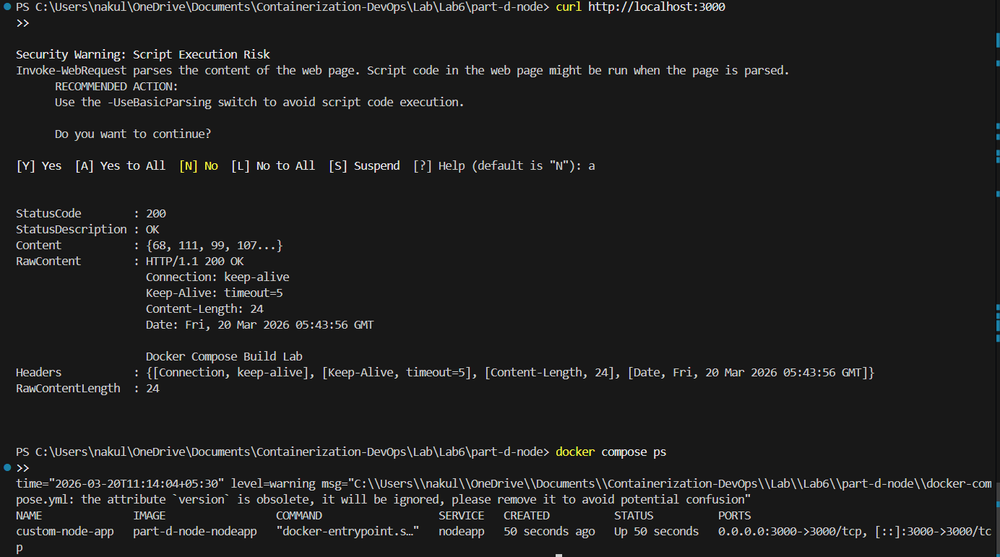
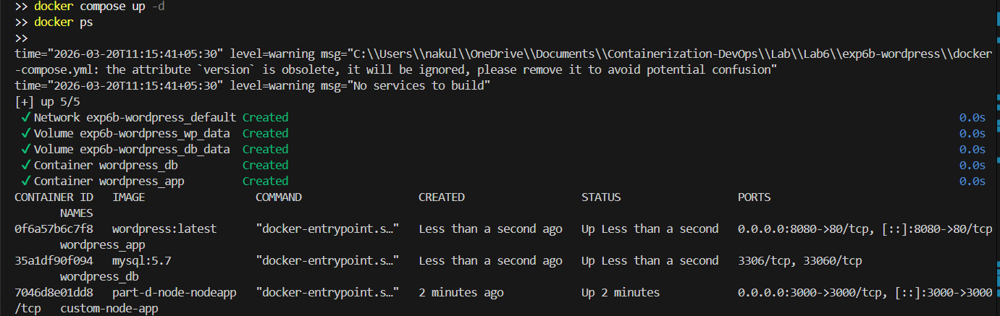
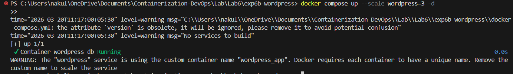

# Experiment 6A: Comparison of Docker Run and Docker Compose

## PART A – THEORY

### 1. Objective
To understand the relationship between Docker Run and Docker Compose, and compare their syntax and use cases.

### 2. Background Theory

#### 2.1 Docker Run (Imperative Approach)
- Used to create and start containers.
- Requires manual flags for everything (Ports, Volumes, Networks, Restart policies, Resources, Names).

**Example:**
```bash
docker run -d \
 --name my-nginx \
 -p 8080:80 \
 -v ./html:/usr/share/nginx/html \
 -e NGINX_HOST=localhost \
 --restart unless-stopped \
 nginx:alpine
```

#### 2.2 Docker Compose (Declarative Approach)
- Uses `docker-compose.yml` to define services, networks, and volumes in a single file.
- One command (`docker compose up -d`) runs everything.

**Equivalent Compose File:**
```yaml
version: '3.8'
services:
  nginx:
    image: nginx:alpine
    container_name: my-nginx
    ports:
      - "8080:80"
    volumes:
      - ./html:/usr/share/nginx/html
    environment:
      NGINX_HOST: localhost
    restart: unless-stopped
```

### 3. Mapping: Docker Run vs Compose

| Docker Run | Docker Compose |
|------------|----------------|
| `-p` | `ports` |
| `-v` | `volumes` |
| `-e` | `environment` |
| `--name` | `container_name` |
| `--network` | `networks` |
| `--restart` | `restart` |
| `--memory` | `deploy.resources.limits.memory` |
| `--cpus` | `deploy.resources.limits.cpus` |

### 4. Advantages of Docker Compose
- Multi-container support
- Reproducibility & Version control
- Unified lifecycle commands
- Scaling capability (`docker compose up --scale web=3`)

---

## PART B – PRACTICAL TASKS

### Task 1: Single Container Comparison

#### Using Docker Run
```bash
docker run -d --name lab-nginx -p 8081:80 -v $(pwd)/html:/usr/share/nginx/html nginx:alpine
curl http://localhost:8081
```



#### Using Docker Compose

**docker-compose.yml**
```yaml
version: '3.8'
services:
  nginx:
    image: nginx:alpine
    container_name: lab-nginx
    ports:
      - "8081:80"
    volumes:
      - ./html:/usr/share/nginx/html
```

```bash
docker compose up -d
docker compose ps
```



---

### Task 2: Multi-Container App (WordPress + MySQL)

#### Using Docker Run (Manual approach)
```bash
docker network create wp-net

docker run -d --name mysql --network wp-net -e MYSQL_ROOT_PASSWORD=secret -e MYSQL_DATABASE=wordpress mysql:5.7

docker run -d --name wordpress --network wp-net -p 8082:80 -e WORDPRESS_DB_HOST=mysql -e WORDPRESS_DB_PASSWORD=secret wordpress:latest
```




*(Note: The equivalent steps in Compose are demonstrated in Experiment 6B below).*

---

## PART C – CONVERSION TASKS (Theory)

Converting manual `docker run` commands and configurations into declarative `docker-compose.yml` configurations:

### Task 3: Convert Run → Compose
**Given Run Command:**
```bash
docker run -d --name webapp -p 5000:5000 -e APP_ENV=production -e DEBUG=false --restart unless-stopped node:18-alpine
```

**Converted Compose File:**
```yaml
version: '3.8'
services:
  webapp:
    image: node:18-alpine
    container_name: webapp
    ports:
      - "5000:5000"
    environment:
      APP_ENV: production
      DEBUG: false
    restart: unless-stopped
```

### Task 4 & 5: Volumes, Networks, and Resource Limits
Compose clearly organizes dependencies, limits, and custom named networks natively without extra CLI scaffolding. *(See lab theory notes for full limit syntax using `deploy:`)*.

---

## PART D – DOCKERFILE WITH COMPOSE

We can combine custom image building with Compose orchestration.

**app.js**
```javascript
const http = require('http');
http.createServer((req, res) => {
  res.end("Docker Compose Build Lab");
}).listen(3000);
```

**Dockerfile**
```dockerfile
FROM node:18-alpine
WORKDIR /app
COPY app.js .
EXPOSE 3000
CMD ["node", "app.js"]
```

**docker-compose.yml**
```yaml
version: '3.8'
services:
  nodeapp:
    build:
      context: .
      dockerfile: Dockerfile
    container_name: custom-node-app
    ports:
      - "3000:3000"
```

```bash
docker compose up --build -d
curl http://localhost:3000
```




---

# Experiment 6B: WordPress + MySQL using Compose

Using a single Compose file completely replaces the manual networking and container execution from Task 2.

**docker-compose.yml**
```yaml
version: '3.9'
services:
  db:
    image: mysql:5.7
    container_name: wordpress_db
    restart: always
    environment:
      MYSQL_ROOT_PASSWORD: rootpass
      MYSQL_DATABASE: wordpress
      MYSQL_USER: wpuser
      MYSQL_PASSWORD: wppass
    volumes:
      - db_data:/var/lib/mysql

  wordpress:
    image: wordpress:latest
    container_name: wordpress_app
    depends_on:
      - db
    ports:
      - "8080:80"
    restart: always
    environment:
      WORDPRESS_DB_HOST: db:3306
      WORDPRESS_DB_USER: wpuser
      WORDPRESS_DB_PASSWORD: wppass
      WORDPRESS_DB_NAME: wordpress
    volumes:
      - wp_data:/var/www/html

volumes:
  db_data:
  wp_data:
```

### 1. Run the Stack
```bash
docker compose up -d
docker ps
```



### 2. Scaling
```bash
docker compose up --scale wordpress=3
```



> **Important Learning Outcome:** The scaling intentionally throws an error because standard Docker Compose is limited here. Since `container_name: wordpress_app` and `ports: "8080:80"` are hardcoded in the file, Compose cannot launch 3 replicas that all want the identical name and host port. This demonstrates the exact scenario where **Docker Swarm** (which handles dynamic naming and load balances identical ports) becomes necessary for production!

---

## Docker Compose vs Swarm Comparison

| Feature | Compose | Swarm |
|---------|---------|-------|
| Scope | Single host | Multi-node |
| Scaling | Manual / Limited by port bindings | Built-in |
| Load balancing | No | Yes |
| Self-healing | No | Yes |

---

## Key Takeaways
1. **Compose simplifies multi-container apps** by keeping settings in version control.
2. **Declarative approach** is much easier than manually tracking `docker run` flags.
3. **Compose is excellent for dev/test**, but limited in native scaling due to port/name collisions without strict dynamic tuning.
4. **Docker Swarm** is much better for production cluster orchestration, load balancing, and self-healing.

---

## 🔗 Navigation

| Previous | Home | Next |
|----------|------|------|
| [← Lab 5](../Lab5/README.md) | [Main README](../../README.md) | [Lab 7 →](../Lab7/README.md) |

### All Labs
- [Lab 1 — VM vs Container Comparison](../Lab-1/README.md)
- [Lab 2 — Docker Installation & GitHub Pages](../Lab2/README.md)
- [Lab 3 — Docker Images, NGINX & Flask Deployment](../Lab3/README.md)
- [Lab 4 — Docker Essentials](../Lab4/README.md)
- [Lab 5 — Volumes, Env Vars, Monitoring, Networks](../Lab5/README.md)
- **Lab 6 — Docker Run vs Docker Compose** *(You are here)*
- [Lab 7 — CI/CD using Jenkins, GitHub & Docker Hub](../Lab7/README.md)
