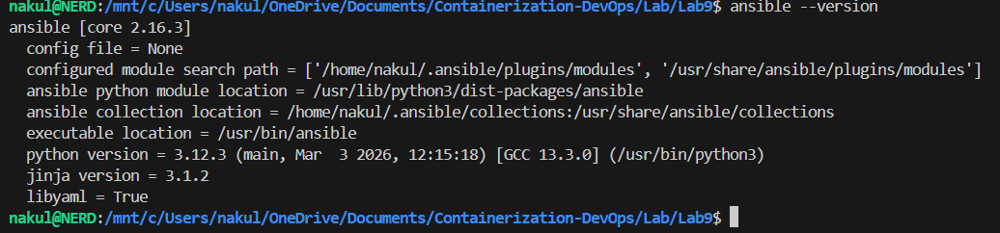
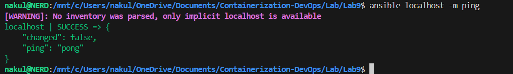
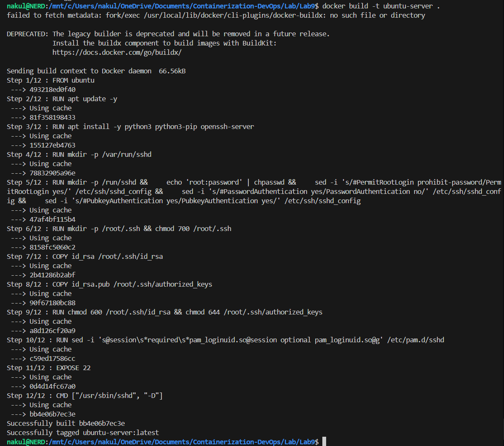
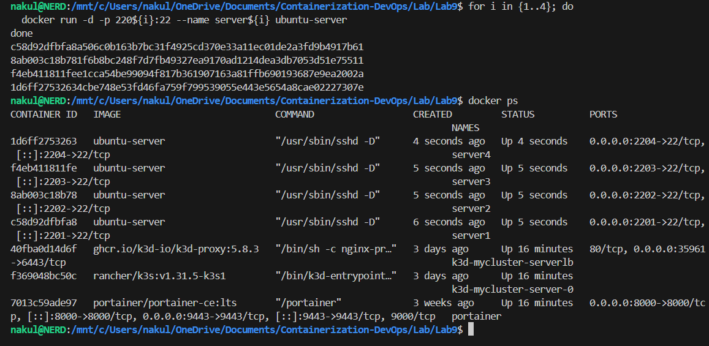
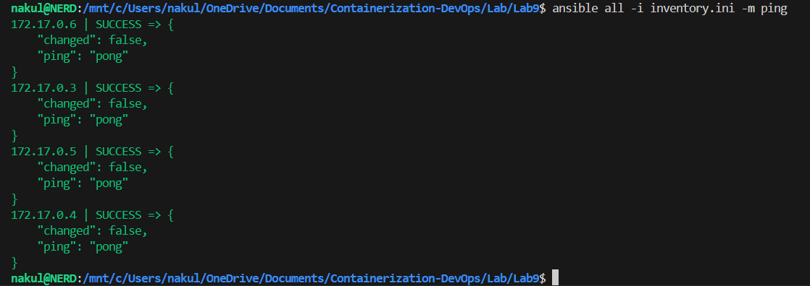
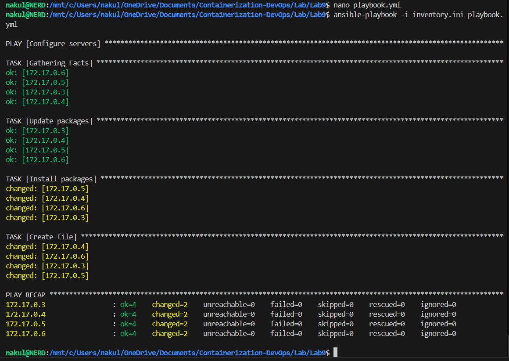
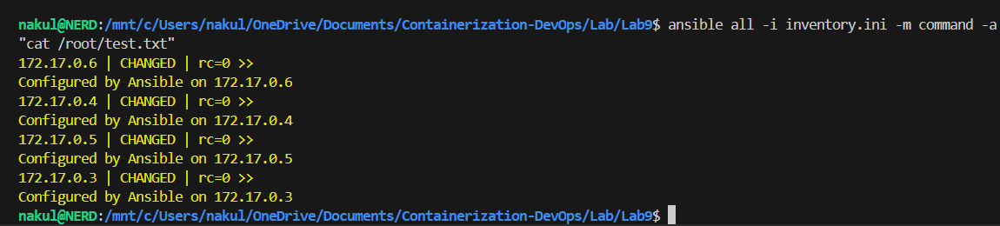

# Experiment 9: Ansible – Execution Prompt

## 🎯 Objective

To automate configuration and management of multiple servers using Ansible playbooks.

## 🛠️ Prerequisites

- Docker Installed and running.
- WSL (Ubuntu) to safely run Ansible as a Control Node.
- Python 3 installed.

---

## 🧩 Steps Performed

### 1. Install Ansible

Ansible was installed inside the Ubuntu WSL environment:

```bash
sudo apt update -y
sudo apt install ansible -y
ansible --version
```

**📸 Screenshot:**


### 2. Test Ansible Installation

Tested base functionality:

```bash
ansible localhost -m ping
```

**📸 Screenshot:**


### 3. Generate SSH Key Pair

Ansible relies on SSH. An RSA Key Pair was created to securely connect to target servers without password prompts:

```bash
ssh-keygen -t rsa -b 4096 -N "" -f ~/.ssh/id_rsa
cp ~/.ssh/id_rsa.pub .
cp ~/.ssh/id_rsa .
```

### 4. Create Dockerfile (Ubuntu SSH Server)

To simulate servers to manage, a `Dockerfile` was created defining an Ubuntu image with SSH and Python installed:

```dockerfile
FROM ubuntu

RUN apt update -y
RUN apt install -y python3 python3-pip openssh-server
RUN mkdir -p /var/run/sshd

RUN mkdir -p /run/sshd && \
    echo 'root:password' | chpasswd && \
    sed -i 's/#PermitRootLogin prohibit-password/PermitRootLogin yes/' /etc/ssh/sshd_config && \
    sed -i 's/#PasswordAuthentication yes/PasswordAuthentication no/' /etc/ssh/sshd_config && \
    sed -i 's/#PubkeyAuthentication yes/PubkeyAuthentication yes/' /etc/ssh/sshd_config

RUN mkdir -p /root/.ssh && chmod 700 /root/.ssh

COPY id_rsa /root/.ssh/id_rsa
COPY id_rsa.pub /root/.ssh/authorized_keys

RUN chmod 600 /root/.ssh/id_rsa && chmod 644 /root/.ssh/authorized_keys

RUN sed -i 's@session\s*required\s*pam_loginuid.so@session optional pam_loginuid.so@g' /etc/pam.d/sshd

EXPOSE 22

CMD ["/usr/sbin/sshd", "-D"]
```

### 5. Build Docker Image

Built our mock server image:

```bash
docker build -t ubuntu-server .
```

**📸 Screenshot:**


### 6. Run Multiple Servers

Deployed four mock servers using Docker:

```bash
for i in {1..4}; do
  docker run -d -p 220${i}:22 --name server${i} ubuntu-server
done
```

**📸 Screenshot:**


### 7. Create Inventory File

Extracted the IPs of the Docker containers and generated an `inventory.ini` mapping so Ansible knows exactly how to connect to them:

```ini
[servers]
<server_ip_1>
<server_ip_2>
<server_ip_3>
<server_ip_4>

[servers:vars]
ansible_user=root
ansible_ssh_private_key_file=~/.ssh/id_rsa
ansible_python_interpreter=/usr/bin/python3
ansible_ssh_common_args='-o StrictHostKeyChecking=no'
```

### 8. Test Connectivity

Ensured Ansible could cleanly reach all target machines:

```bash
ansible all -i inventory.ini -m ping
```

**📸 Screenshot:**


### 9. Create Playbook

Wrote an Ansible Playbook (`playbook.yml`) to automatically install packages and deploy a text file to all remote nodes.

```yaml
---
- name: Configure servers
  hosts: all
  become: yes

  tasks:
    - name: Update packages
      apt:
        update_cache: yes

    - name: Install packages
      apt:
        name: ["vim", "htop", "wget"]
        state: present

    - name: Create file
      copy:
        dest: /root/test.txt
        content: "Configured by Ansible on {{ inventory_hostname }}\n"
```

### 10. Run Playbook

Executed the playbook against all four dummy servers:

```bash
ansible-playbook -i inventory.ini playbook.yml
```

**📸 Screenshot:**


### 11. Verify Output

Remotely checked the outcome on the target servers:

```bash
ansible all -i inventory.ini -m command -a "cat /root/test.txt"
```

**📸 Screenshot:**


### 12. Cleanup

Removed all test simulation containers:

```bash
for i in {1..4}; do
  docker rm -f server${i}
done
```

---

## ✅ Results

- Ansible successfully initialized and mapped to multi-node targets dynamically.
- `inventory.ini` effectively permitted connection overriding local Windows permissions mappings.
- The `playbook.yml` securely provisioned 4 nodes installing `vim`, `htop`, `wget` securely without failing.
- A dynamically verified file `/root/test.txt` proved environment replication and template integration!
