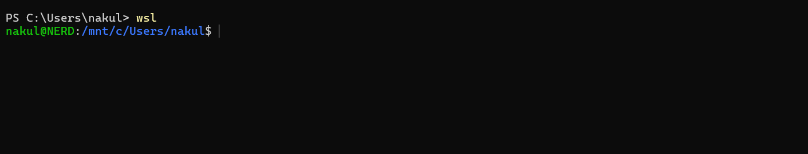
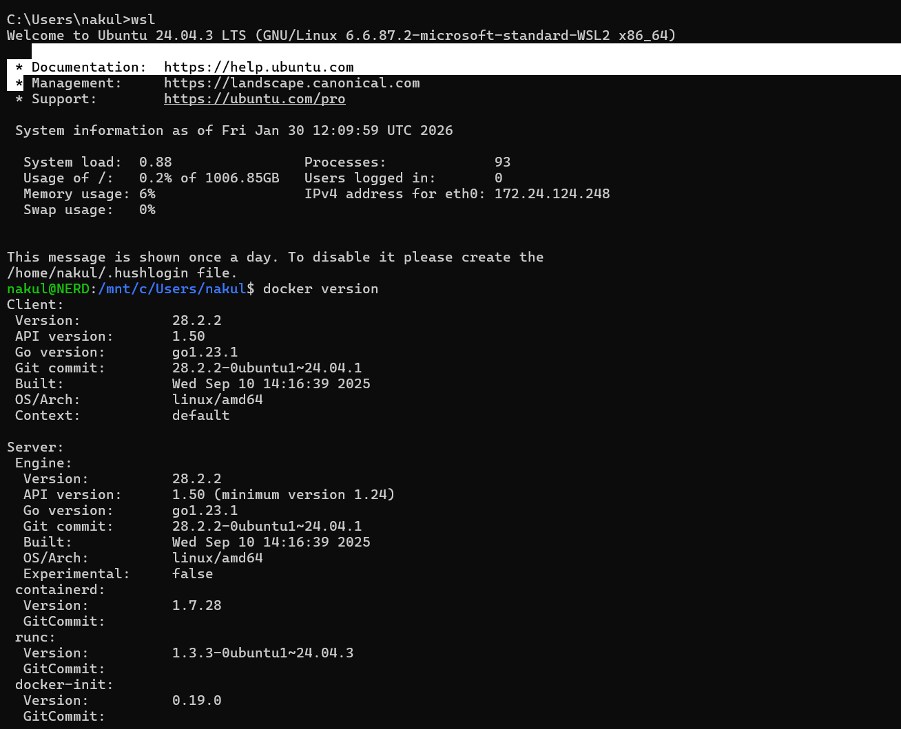
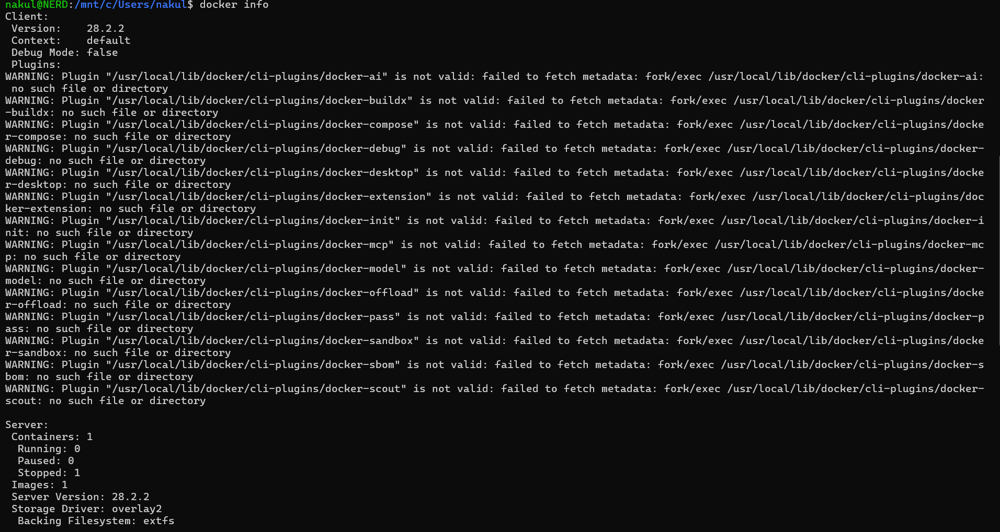
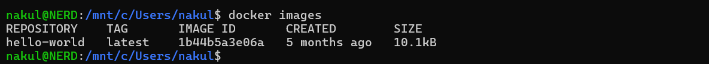
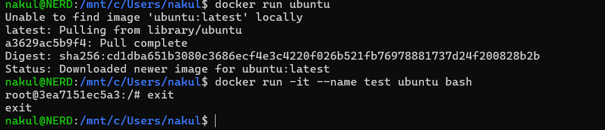
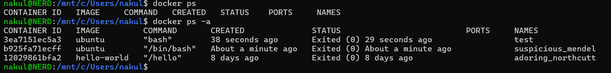

#  Class 1 -- Docker Basics (Hands-on)

##  Objective

-   To understand Docker fundamentals
-   To execute basic Docker commands
-   To observe Docker image and container lifecycle using WSL (Ubuntu)

------------------------------------------------------------------------

##  Environment Used

-   Host OS: Windows
-   Linux Environment: WSL (Ubuntu 24.04)
-   Container Platform: Docker Engine
-   Terminal: WSL Ubuntu

------------------------------------------------------------------------

##  Experiment Execution with Screenshots

### 🔹 Step 1: Launch WSL Ubuntu

Docker commands are executed inside WSL Ubuntu terminal.

**Commands executed:**

``` bash
wsl
```



------------------------------------------------------------------------

### 🔹 Step 2: Verify Docker Installation

Docker client and server versions are verified.

**Commands executed:**

``` bash
docker version
```



------------------------------------------------------------------------

### 🔹 Step 3: Inspect Docker System Information

This step checks Docker engine configuration and runtime details.

**Commands executed:**

``` bash
docker info
```



------------------------------------------------------------------------

### 🔹 Step 4: View Available Docker Images

Initially checks for locally available Docker images.

**Commands executed:**

``` bash
docker images
```



------------------------------------------------------------------------

### 🔹 Step 5: Pull and Run Ubuntu Image

Ubuntu image is pulled automatically if not available and container is
executed.

**Commands executed:**

``` bash
docker run ubuntu
docker run -it --name test ubuntu bash
exit
```



------------------------------------------------------------------------

### 🔹 Step 6: Check Container Status

Both running and stopped containers are inspected.

**Commands executed:**

``` bash
docker ps
docker ps -a
```



------------------------------------------------------------------------

##  Result

Docker was successfully verified on WSL Ubuntu. Ubuntu containers were
created, executed, exited, and inspected using Docker CLI commands.

------------------------------------------------------------------------

##  Learning Outcome

-   Understood Docker client-server architecture
-   Learned how Docker images are pulled and containers are created
-   Observed container lifecycle using `docker ps` and `docker ps -a`
-   Gained hands-on experience with Docker in WSL environment


