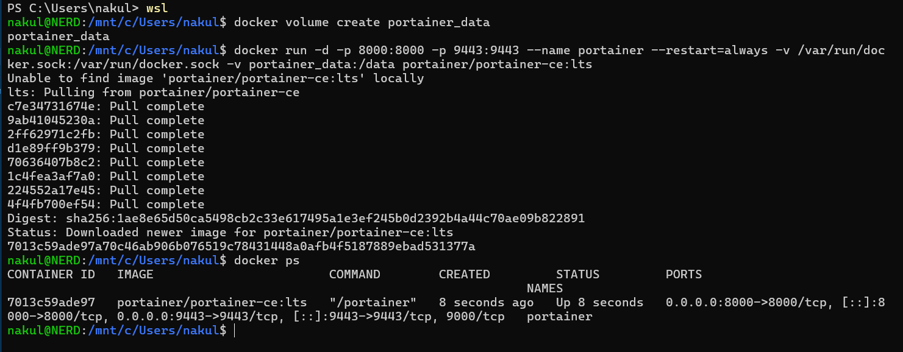
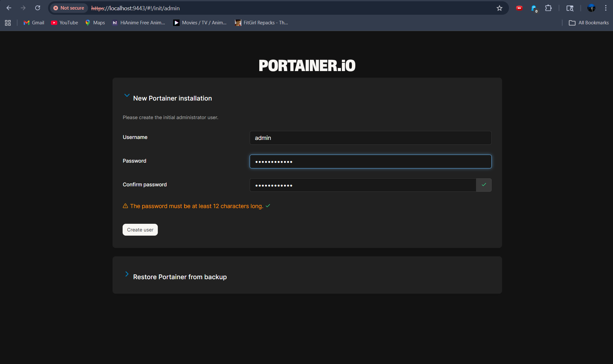
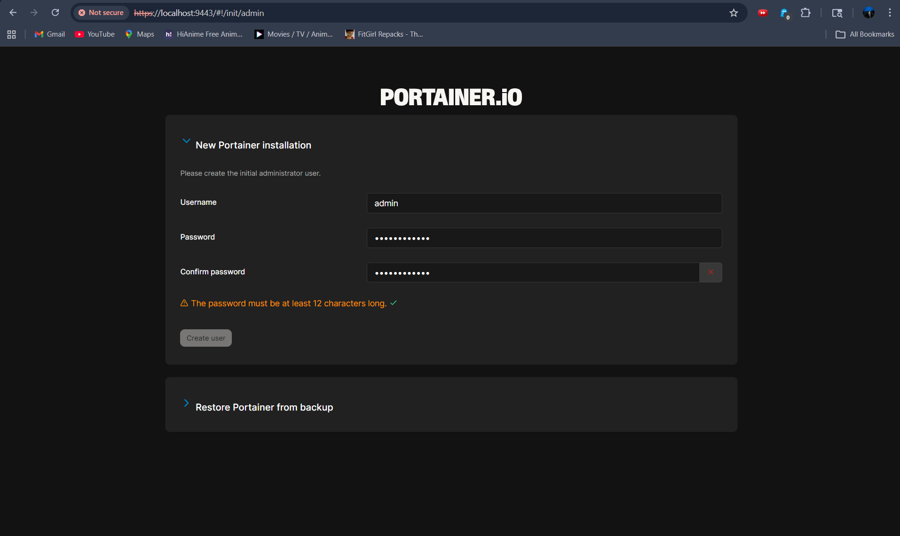
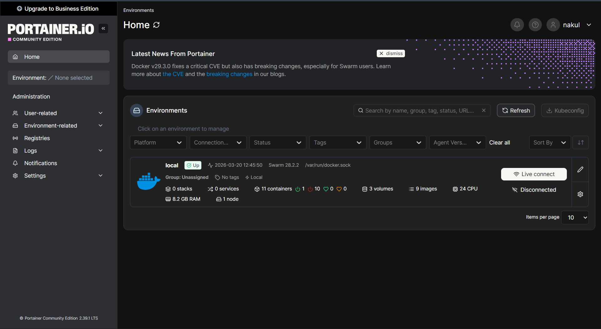

# Class 10 - Docker GUI Management with Portainer (Hands-on)

In this class, we covered how to install and manage **Portainer**, a lightweight management UI which allows you to easily manage your different Docker environments.

## 1. Installing Portainer

First, you need to create a volume that Portainer Server will use to store its database:
```bash
docker volume create portainer_data
```

Then, download and install the Portainer Server container:
```bash
docker run -d -p 8000:8000 -p 9443:9443 --name portainer \
    --restart=always \
    -v /var/run/docker.sock:/var/run/docker.sock \
    -v portainer_data:/data \
    portainer/portainer-ce:lts
```

Check that the container is running:
```bash
docker ps
```
### Terminal Output


## 2. Accessing Portainer Web UI

After running the container, open your web browser and navigate to:
`https://localhost:9443`

*Note: You may receive a warning about a self-signed certificate, which you can bypass for local development.*

Upon your first login, you will be prompted to create the initial administrator user.



## 3. Portainer Dashboard

Once logged in, you can select your `local` Docker environment and manage containers, images, volumes, and networks directly from the UI.


---
[- Previous Class](../Class9/Part2/README.md) | [Theory Index](../README.md)
