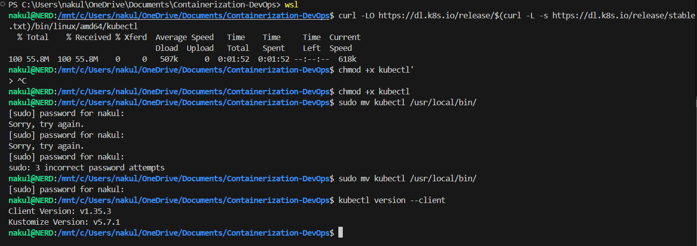
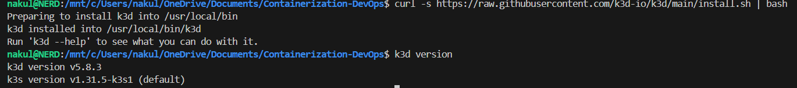
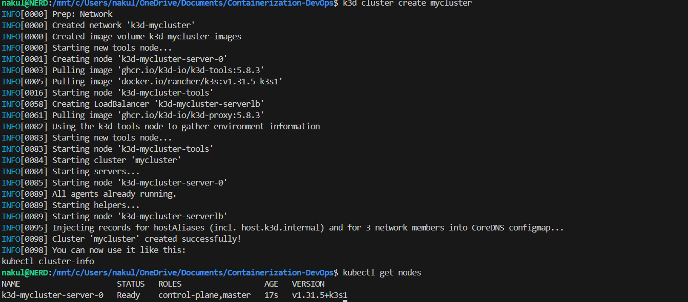
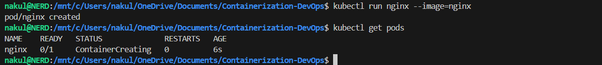
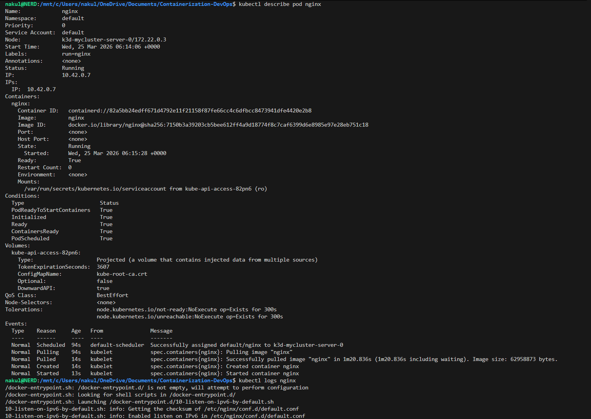
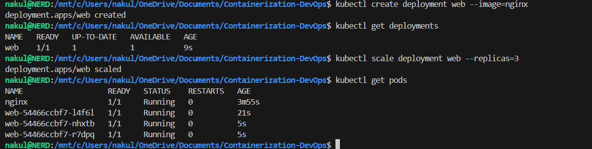
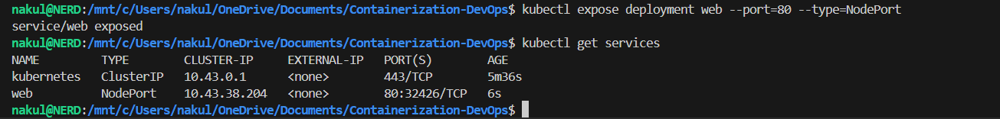
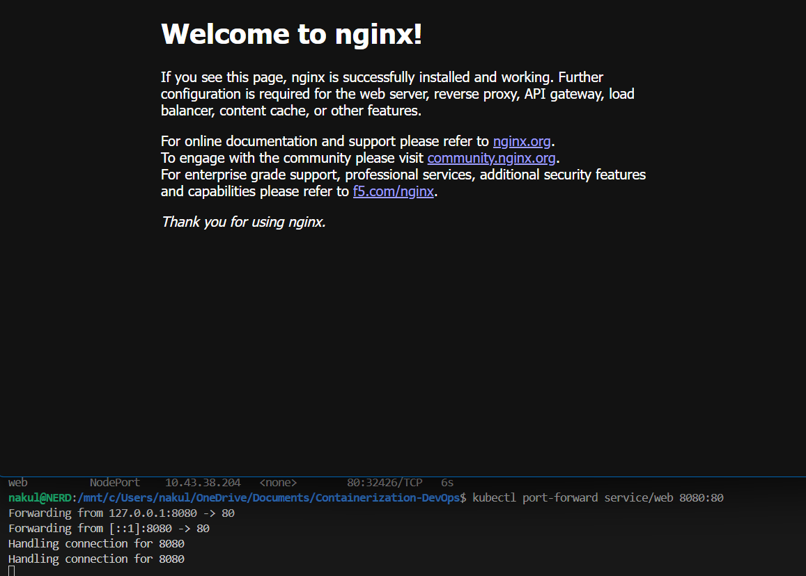
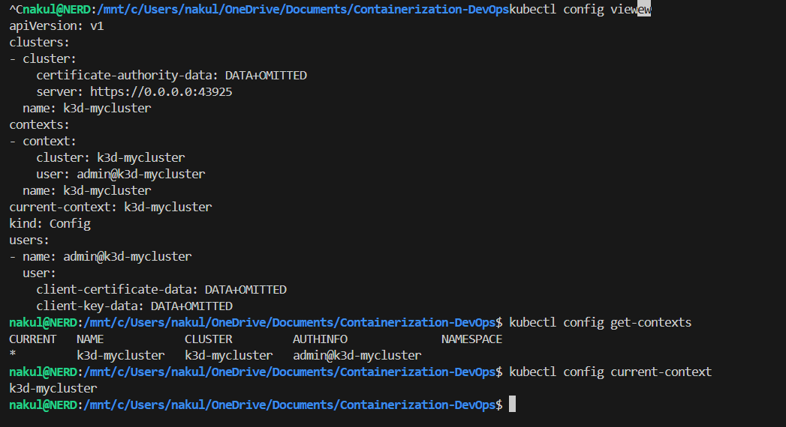
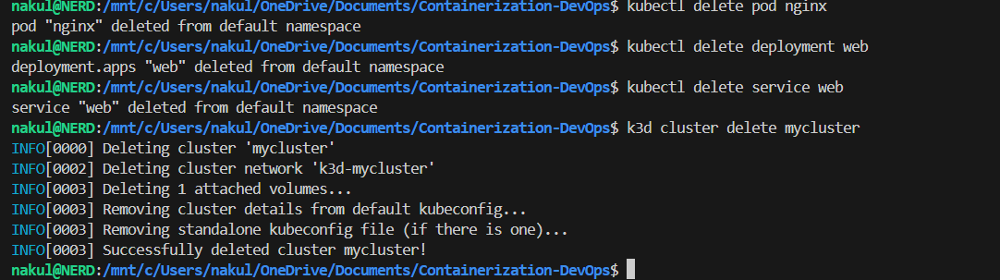

# Class 11 - Introduction to Kubernetes & Local Setup (Hands-on)

In this class, we covered the fundamentals of **Kubernetes**, why it is needed for container orchestration, its core architecture, and how to set up a **local Kubernetes cluster** using **k3d** and **kubectl** on WSL.

---

## 1. Why Kubernetes?

Modern applications use multiple services (backend, frontend, database, cache, message queues, monitoring). Without orchestration, managing these becomes difficult:

| Problem | Description |
|---|---|
| Startup Order | Services must start in correct sequence |
| Scaling | Handle traffic spikes dynamically |
| Crash Recovery | Restart failed containers automatically |
| Networking | Containers need to discover and talk to each other |
| Rolling Updates | Deploy new versions without downtime |

**Kubernetes automates** all of this — deployment, scaling, self-healing, service discovery, load balancing, and rolling updates.

---

## 2. Core Architecture

### Control Plane (Master)
| Component | Role |
|---|---|
| **API Server** | Entry point for all commands |
| **Scheduler** | Decides where containers run |
| **Controller Manager** | Maintains desired state (e.g., keeps 3 replicas running) |
| **etcd** | Key-value store for cluster data |

### Worker Nodes
| Component | Role |
|---|---|
| **Kubelet** | Communicates with control plane |
| **Container Runtime** | Runs containers (Docker, containerd) |
| **Kube Proxy** | Handles networking |

---

## 3. Local Kubernetes Tools

| Tool | Description | Best For |
|---|---|---|
| **Minikube** | Single-node cluster | Beginners |
| **k3s** | Lightweight Kubernetes | Edge/IoT |
| **k3d** | k3s inside Docker | Fast local dev |
| **kind** | Kubernetes in Docker | CI/CD testing |

**Our stack: WSL + kubectl + k3d** — lightweight, fast, and runs entirely inside Docker.

---

## 4. Installing kubectl

Download, make executable, and move to path:

```bash
curl -LO https://dl.k8s.io/release/$(curl -L -s https://dl.k8s.io/release/stable.txt)/bin/linux/amd64/kubectl
chmod +x kubectl
sudo mv kubectl /usr/local/bin/
kubectl version --client
```

### Terminal Output


---

## 5. Installing k3d

```bash
curl -s https://raw.githubusercontent.com/k3d-io/k3d/main/install.sh | bash
k3d version
```

### Terminal Output


---

## 6. Creating a Kubernetes Cluster

```bash
k3d cluster create mycluster
kubectl get nodes
```

k3d creates a single-node cluster running k3s inside Docker. The `kubectl get nodes` command shows the node with `STATUS: Ready`.

### Terminal Output


---

## 7. Running a Pod

A **Pod** is the smallest deployable unit in Kubernetes. Here we run a standalone nginx pod:

```bash
kubectl run nginx --image=nginx
kubectl get pods
```

### Terminal Output


---

## 8. Inspecting a Pod

Use `describe` to see full details and `logs` to see container output:

```bash
kubectl describe pod nginx
kubectl logs nginx
```

- `describe` shows: Name, Namespace, Node, IP, Status, Conditions, Events
- `logs` shows the container's stdout (nginx startup logs)

### Terminal Output


---

## 9. Creating and Scaling a Deployment

A **Deployment** manages replicas and rolling updates. Here we create one and scale to 3 replicas:

```bash
kubectl create deployment web --image=nginx
kubectl get deployments
kubectl scale deployment web --replicas=3
kubectl get pods
```

After scaling, we can see 4 pods total — 1 standalone `nginx` pod + 3 `web-xxxxx` deployment pods.

### Terminal Output


---

## 10. Exposing the Application

Expose the deployment as a **NodePort** service to make it accessible:

```bash
kubectl expose deployment web --port=80 --type=NodePort
kubectl get services
```

### Terminal Output


---

## 11. Port Forwarding & Browser Access

Use `port-forward` to access the service from localhost:

```bash
kubectl port-forward service/web 8080:80
```

Open browser at **http://localhost:8080** — the Nginx welcome page confirms the app is running!

### Terminal Output & Browser


---

## 12. Exploring kubeconfig

The **kubeconfig** file (`~/.kube/config`) contains cluster connection details. It has 3 parts:

```yaml
# 1. Clusters — server address & CA
clusters:
- name: k3d-mycluster
  cluster:
    server: https://0.0.0.0:43925

# 2. Users — credentials
users:
- name: admin@k3d-mycluster
  user:
    client-certificate-data: DATA+OMITTED

# 3. Contexts — links cluster + user
contexts:
- name: k3d-mycluster
  context:
    cluster: k3d-mycluster
    user: admin@k3d-mycluster

current-context: k3d-mycluster
```

```bash
kubectl config view
kubectl config get-contexts
kubectl config current-context
```

### How kubectl Works Internally

```
kubectl command
  → reads kubeconfig
    → finds current context
      → gets cluster address + user credentials
        → connects to API server
          → executes command
```

### Terminal Output


---

## 13. Cleanup

Delete all resources and destroy the cluster:

```bash
kubectl delete pod nginx
kubectl delete deployment web
kubectl delete service web
k3d cluster delete mycluster
```

### Terminal Output


---

## Summary

| Concept | What We Did |
|---|---|
| **kubectl** | Installed CLI tool to interact with Kubernetes |
| **k3d** | Created lightweight local cluster inside Docker |
| **Pod** | Ran a standalone nginx container |
| **Deployment** | Created managed replicas with scaling |
| **Service** | Exposed the app with NodePort |
| **Port Forward** | Accessed nginx from browser at localhost:8080 |
| **kubeconfig** | Explored cluster, user, and context configuration |

---

[← Previous Class](../Class10/README.md) | [Theory Index](../README.md)
