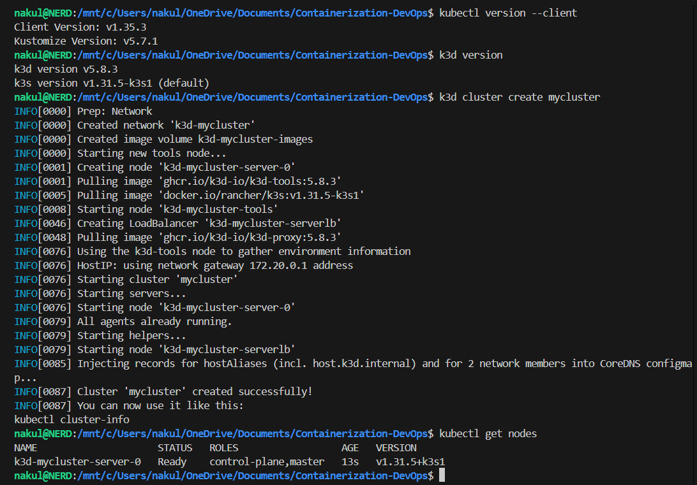
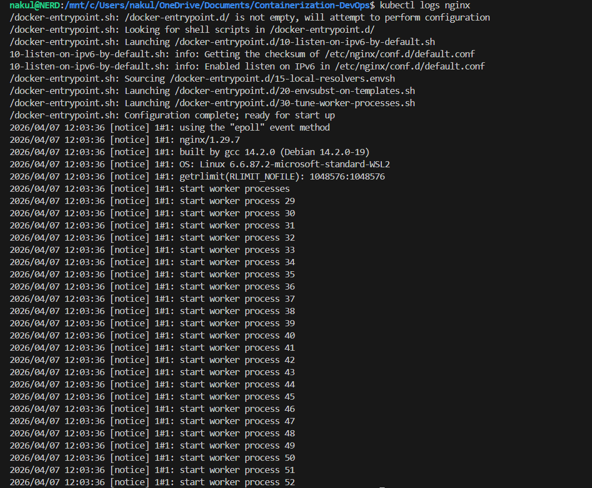
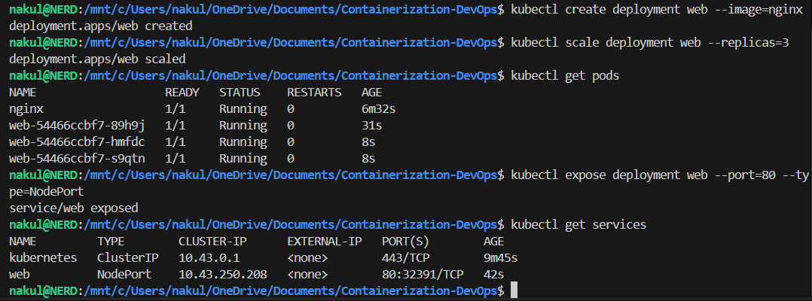

# Class 12 - Kubernetes 2 (Review & Basics)

## 1. Introduction to Kubernetes

**What is Kubernetes?**
Kubernetes is a platform used to:
- Deploy applications
- Scale them
- Manage containers automatically

👉 It handles everything needed to run apps reliably.

**Why Kubernetes is Needed**
Modern apps have:
- Backend
- Frontend
- Database
- Cache

**Problems without Kubernetes:**
- Hard to start services in order
- No automatic scaling
- Difficult networking
- No crash recovery

**Solution:**
Kubernetes automates:
- Deployment
- Scaling
- Self-healing
- Load balancing

---

## 2. Kubernetes Architecture

A cluster has 2 main parts:

### A. Control Plane (Master)
Components:
1. **API Server:** Entry point, all commands go through it
2. **Scheduler:** Decides where containers run
3. **Controller Manager:** Maintains desired state (e.g., Keeps 3 pods running)
4. **etcd:** Stores cluster data

### B. Worker Nodes
Components:
1. **Kubelet:** Talks to control plane
2. **Container Runtime:** Runs containers (Example: Docker)
3. **Kube Proxy:** Handles networking

---

## 3. Why Not Real Kubernetes for Learning?

Real clusters need:
- Multiple nodes
- High RAM (16–32 GB)
- Complex setup

👉 Not suitable for laptops

---

## 4. Tools for Local Kubernetes

| Tool | Characteristics |
|---|---|
| **Minikube** | Single node, Beginner friendly |
| **k3s** | Lightweight Kubernetes |
| **k3d** | Runs k3s in Docker, Fast and easy |
| **kind** | Kubernetes in Docker, Good for testing |

---

## 5. Recommended Setup

- **WSL** → Linux environment
- **kubectl** → Command tool
- **k3d** → Fast cluster
- **Lens (optional GUI)** → Visual UI

---

## 6. Installation

### Install kubectl
```bash
curl -LO https://dl.k8s.io/release/stable/bin/linux/amd64/kubectl
chmod +x kubectl
sudo mv kubectl /usr/local/bin/
kubectl version --client
```

### Install k3d
```bash
curl -s https://raw.githubusercontent.com/k3d-io/k3d/main/install.sh | bash
```

### Create Cluster
```bash
k3d cluster create mycluster
kubectl get nodes
```

### Terminal Output


---

## 7. kubectl Basics

**What is kubectl?**
CLI tool to interact with Kubernetes.

**Cluster Connection**
`kubectl` uses: `~/.kube/config`
Contains:
- Cluster info
- Credentials
- Context

**View Clusters**
```bash
kubectl config get-contexts
```

**Switch Cluster**
```bash
kubectl config use-context k3d-mycluster
```

---

## 8. Common Commands (IMPORTANT)

**View Nodes:**
```bash
kubectl get nodes
```

**View Pods:**
```bash
kubectl get pods
```

**Run Container:**
```bash
kubectl run nginx --image=nginx
```

**Pod Details:**
```bash
kubectl describe pod nginx
```

**Logs:**
```bash
kubectl logs nginx
```

### Terminal Output


---

## 9. Deployment

**Create Deployment:**
```bash
kubectl create deployment web --image=nginx
```

**Scale App:**
```bash
kubectl scale deployment web --replicas=3
```

**Expose App:**
```bash
kubectl expose deployment web --port=80 --type=NodePort
```

**Access App:**
```bash
kubectl port-forward service/web 8080:80
```

**Delete:**
```bash
kubectl delete pod nginx
kubectl delete deployment web
```

### Terminal Output


---

## 10. Advanced Topics (Mention Only)

- Ingress
- ConfigMaps
- Secrets
- Storage
- Helm
- CI/CD

---

## 11. kubeconfig Deep Understanding

**3 Main Sections:**
1. **Clusters:** Server address
2. **Users:** Credentials
3. **Context:** Cluster + User

**Current Context:**
`current-context: k3d-mycluster`

---

## 12. How kubectl Works

1. Reads `kubeconfig`
2. Finds context
3. Connects to API server
4. Executes command

---

## 13. Common Issues

**`kubectl` not working:**
- Wrong context
- Missing config

**Fix:**
```bash
kubectl config use-context <correct-cluster>
```

---

## 14. Simple Analogy

- **Cluster** → Server
- **User** → Login
- **Context** → Selected account
- **kubectl** → Client

---

## 15. Final Summary

Kubernetes manages containers automatically.
- Uses declarative approach
- Handles scaling, failures, networking

🔥 **One-Line Memory Trick:**
> Kubernetes = “System that ensures your app runs exactly how you defined.”

---

[← Previous Class](../Class11/README.md) | [Theory Index](../README.md)
