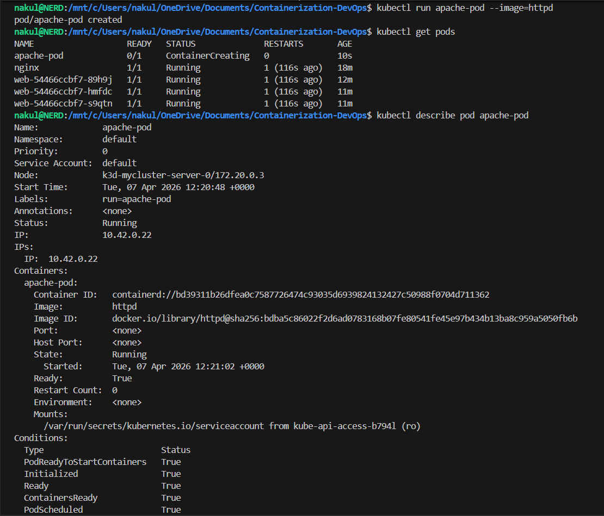
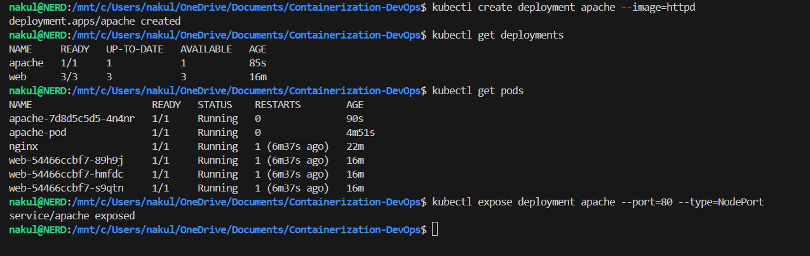
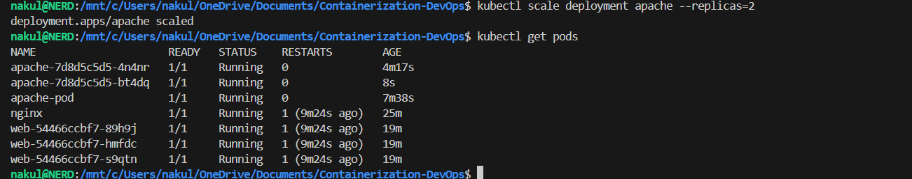
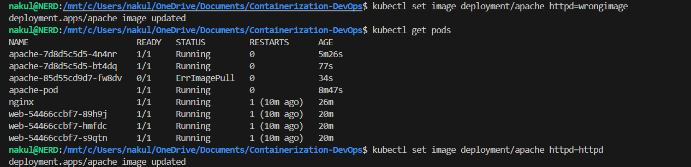
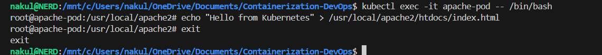
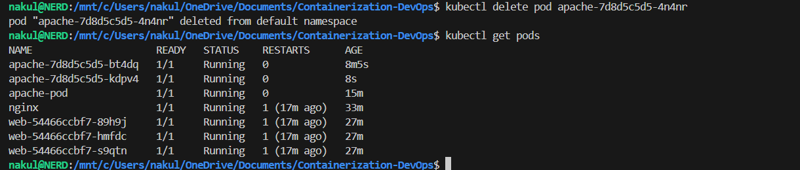
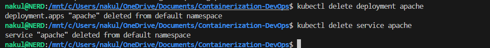

# Class 13 - Apache Web App Deployment & Debugging 

## 1. Objective

Deploy and manage an Apache web server and:
- Verify it runs
- Modify it
- Scale it
- Debug it

---

## 2. Step-by-Step Flow (IMPORTANT)

### Step 1: Run a Pod (Basic)
```bash
kubectl run apache-pod --image=httpd
kubectl get pods
```
👉 Creates a single temporary pod

### Step 2: Inspect Pod
```bash
kubectl describe pod apache-pod
```
**Check for:**
- Image = httpd
- Port = 80
- Events

### Step 3: Access App
```bash
kubectl port-forward pod/apache-pod 8081:80
```
Open: http://localhost:8081
👉 You will see: **“It works!”**

### Terminal Output


### Step 4: Delete Pod
```bash
kubectl delete pod apache-pod
```
**Insight:** Pod is deleted permanently. 
❌ No recovery.

---

## 3. Why Pod is Not Enough

👉 **Pod** = Temporary
👉 **No self-healing**

---

## 4. Convert to Deployment (IMPORTANT)

### Step 5: Create Deployment
```bash
kubectl create deployment apache --image=httpd
kubectl get deployments
kubectl get pods
```
👉 Deployment manages pods.

### Step 6: Expose Deployment
```bash
kubectl expose deployment apache --port=80 --type=NodePort
```

**Access App:**
```bash
kubectl port-forward service/apache 8082:80
```
Open: http://localhost:8082

### Terminal Output


---

## 5. Scaling (VERY IMPORTANT)

### Step 7: Scale
```bash
kubectl scale deployment apache --replicas=2
kubectl get pods
```
👉 **Now:** 
- Multiple pods run the same app
- Better availability

**Observation:** Refresh the browser. Requests are handled by different pods.

### Terminal Output


---

## 6. Debugging (MOST IMPORTANT SKILL)

### Step 8: Break App
```bash
kubectl set image deployment/apache httpd=wrongimage
```

### Step 9: Diagnose
```bash
kubectl get pods
kubectl describe pod <pod-name>
```
**Error:** `ImagePullBackOff`

### Step 10: Fix
```bash
kubectl set image deployment/apache httpd=httpd
```

### Terminal Output


---

## 7. Work Inside Container

### Step 11: Enter Pod
```bash
kubectl exec -it <pod-name> -- /bin/bash
```

**Check Files:**
```bash
ls /usr/local/apache2/htdocs
```
👉 This is where website files are stored.

**Exit:**
```bash
exit
```

---

## 8. Modify App (COOL PART)
```bash
kubectl exec -it <pod-name> -- /bin/bash
echo "Hello from Kubernetes" > /usr/local/apache2/htdocs/index.html
```
👉 **Refresh browser** → Content changes!

### Terminal Output


---

## 9. Self-Healing (VERY IMPORTANT CONCEPT)

### Step 12: Delete One Pod
```bash
kubectl delete pod <pod-name>
kubectl get pods -w
```
👉 **Kubernetes automatically:** Creates a new pod.

**Insight:**
Deployment ensures: Desired state = maintained.

### Terminal Output


---

## 10. Cleanup
```bash
kubectl delete deployment apache
kubectl delete service apache
```

### Terminal Output


---

## 11. Port Forwarding (Important Theory)

**Why it blocks the terminal:**
Runs a live connection with continuous data flow.

**Run in Background:**
```bash
kubectl port-forward pod/apache-pod 8081:80 &
```

**Manage Processes:**
```bash
jobs
ps aux | grep port-forward
kill %1
kill <PID>
pkill -f port-forward
```

**Best Practice:**
```bash
tmux new -s pf
kubectl port-forward pod/apache-pod 8081:80
```
**Detach:** `Ctrl + b`, then `d`

---

## 12. Key Concepts (VERY IMPORTANT FOR EXAM)

### Pod vs Deployment
| Feature | Pod | Deployment |
|---|---|---|
| Lifespan | Temporary | Permanent |
| Failure | No recovery | Self-healing |
| Management| Manual | Automated |

### Port Forwarding
- Only for debugging
- Not for production

### Service
- Stable access point

### Scaling
- Multiple pods = reliability

### Debugging
👉 `kubectl describe` = **Most important command**

---

## 🔥 FINAL UNDERSTANDING

**This lab teaches:**
- Real deployment
- Scaling
- Debugging
- Self-healing
- Container internals

---

[← Previous Class](../Class12/README.md) | [Next Class →](../Class14/README.md) | [Theory Index](../README.md)
