# Class 14 - Git Basics (Hands-on)

## 1. Objective

Master the fundamental concepts and commands of Git, including:
- Repository initialization and basic commits
- Viewing history with graph logs
- Checking diffs and status
- Branch creation and navigation
- Detached HEAD states and merging

---

## 2. Step-by-Step Flow (According to Screenshots)

### Step 1: Initialize Git and First Commit
Using `init` to start tracking. Changing default branch name, making edits, staging, and committing.
```bash
git init
git branch -M master
echo test > test
git add .
git commit -m "test"
git log
```
👉 The `git init` command creates a hidden `.git` folder.

### Terminal Output
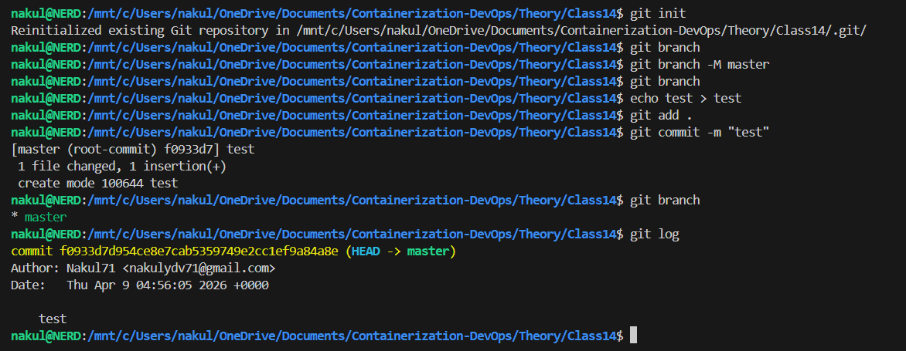

---

### Step 2: Second Commit
Adding another file and committing. Let's see the history growth.
```bash
echo test2 > test2.txt
git add . && git commit -m "test2"
git log
```

### Terminal Output
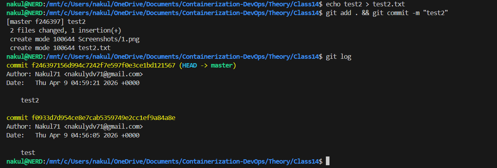

---

### Step 3: Third Commit & Graph Log
Using short logs to visualize history properly.
```bash
echo test3 > test3.txt
git add . && git commit -m "test3"
git log --oneline
git log --oneline --graph
```
👉 `--oneline --graph` visualizes the branch history in a concise format.

### Terminal Output
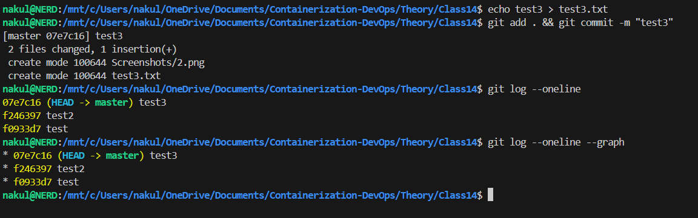

---

### Step 4: Git Diff and Status
Reviewing unsaved changes before a commit.
```bash
echo test3secondline >> test3.txt
git diff
git status
```
👉 `git diff` shows the exact line changes in modified files.
👉 `git status` distinguishes between modified and untracked files.

### Terminal Output
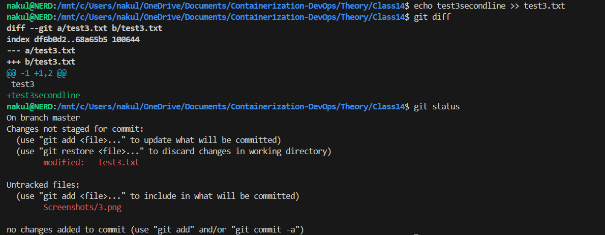

---

### Step 5: Untracked Files Status
Creating new files to observe `git status` output.
```bash
echo test4secondline >> test4.txt
git status
```

### Terminal Output
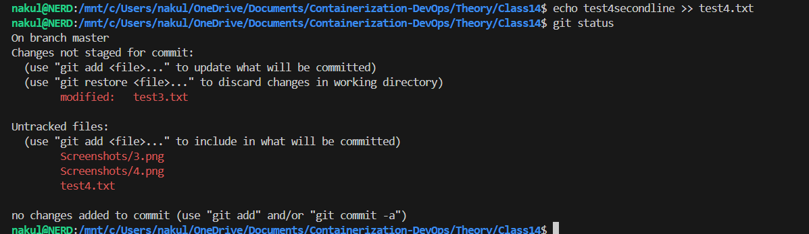

---

### Step 6: Committing Modified Files
Saving the specific modifications shown above.
```bash
git commit -m "test3 modified"
git status
```

### Terminal Output
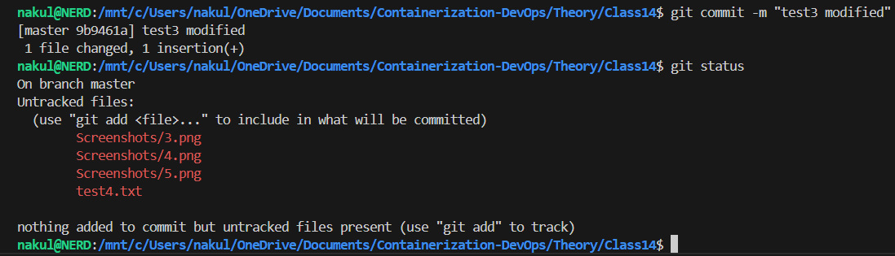

---

### Step 7: Branching Basics
Creating and navigating between branches.
```bash
git branch main
git switch main
git checkout master
```
👉 `git branch` creates or lists branches. `git switch` or `git checkout` change the active branch.

### Terminal Output
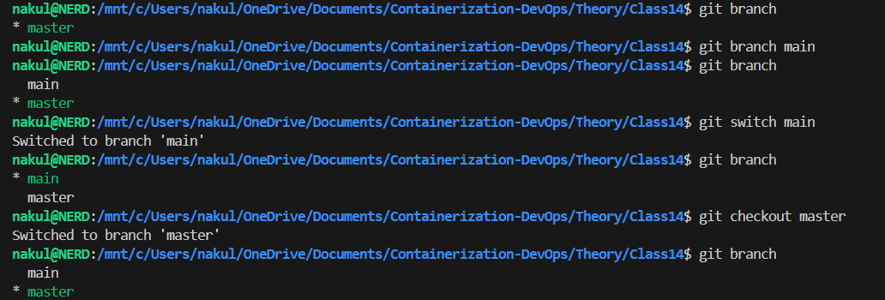

---

### Step 8: Detached HEAD State
Checking out a specific point in time (commit hash).
```bash
git log --oneline --graph
git checkout f246397
git checkout main
```
👉 **Warning:** When in "detached HEAD", changes aren't associated with a branch unless a new branch is explicitly created.

### Terminal Output
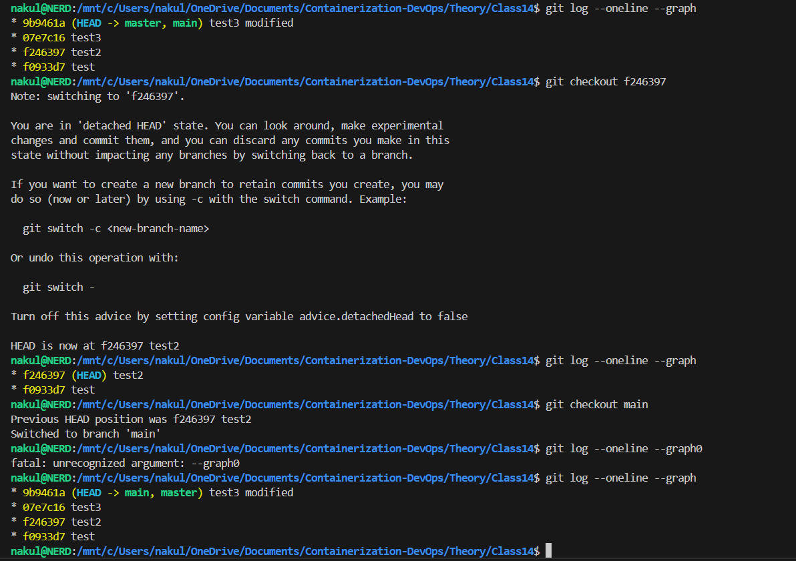

---

### Step 9: Deleting a Branch
Deleting the `master` branch.
```bash
git branch && git branch -D master
```

### Terminal Output
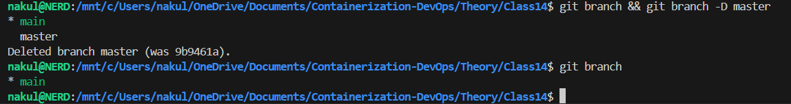

---

### Step 10: Creating Branch from Detached HEAD
Creating a new branch to keep specific snapshot commits.
```bash
# While detached at an older commit
git branch feature
git branch
```

### Terminal Output
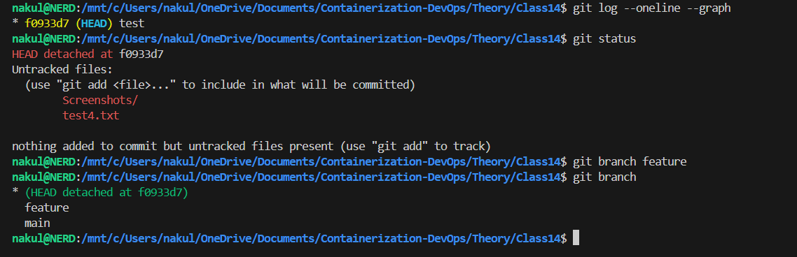

---

### Step 11: Merging (Already Up to Date)
Attempting a merge when the current branch has the history of the target.
```bash
git checkout main
git merge feature
```

### Terminal Output
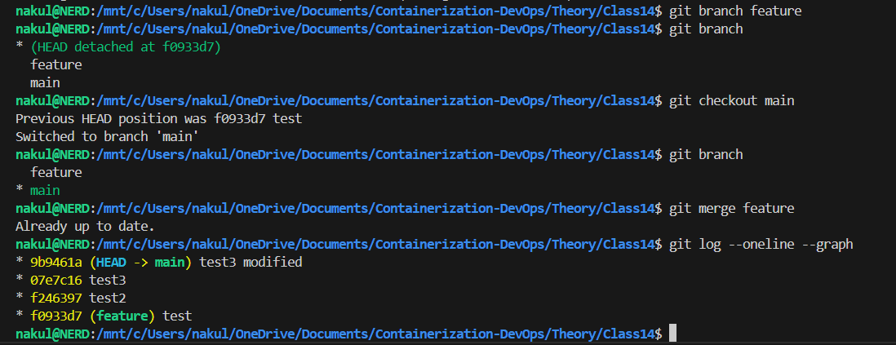

---

### Step 12: Adding Commits to Feature Branch
```bash
git checkout feature
echo "dummy feature" > feature.txt
git add .
git commit -m "feature added"
```

### Terminal Output
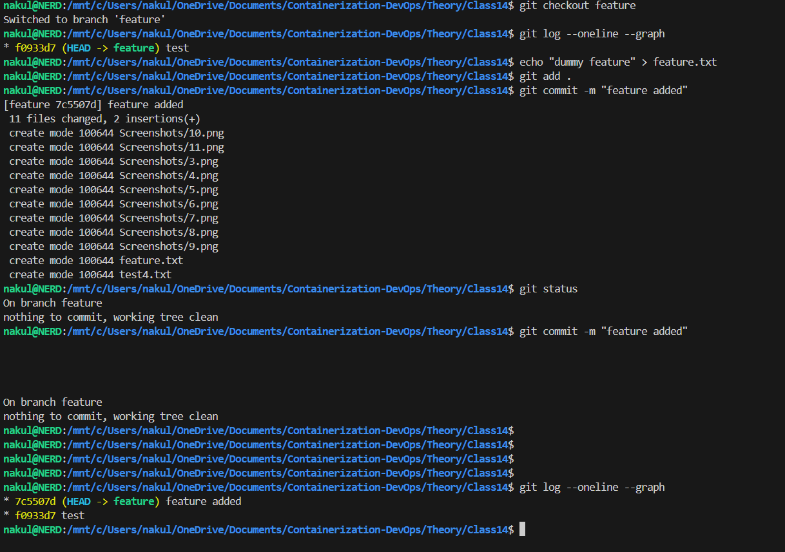

---

### Step 13: The Final Merge
```bash
# From main branch
git merge feature
git log --oneline --graph
```
👉 This creates a true merge commit combining the history of both branches.

### Terminal Output
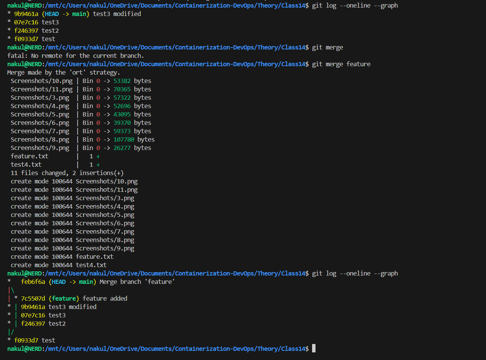

---

## 3. Key Git Commands Summary

| Command | Description |
|---|---|
| `git init` | Initialize a new Git repository |
| `git add <file>` | Stage changes for commit |
| `git commit -m "msg"` | Save staged changes with a message |
| `git status` | Show the state of the working directory |
| `git log` | Show commit history |
| `git diff` | Show changes between commits/working tree |
| `git branch` | List, create, or delete branches |
| `git checkout` | Switch branches or restore working tree files |
| `git merge` | Join two or more development histories together |

---

## 4. Final Insight
Git is essential for version control, allowing developers to track changes, collaborate effectively, and revert to previous states if something goes wrong. Understanding branches and merges is the key to managing complex projects.

---

[← Previous Class](../Class13/README.md) | [Theory Index](../README.md)
