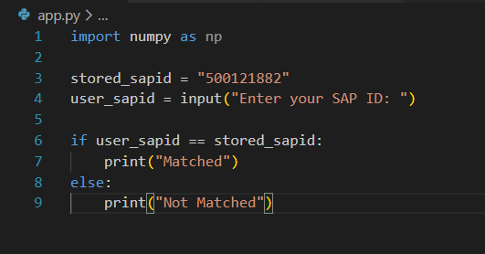
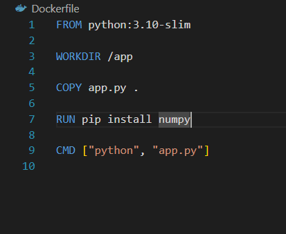
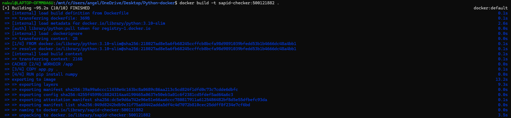
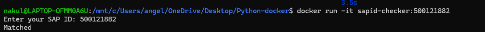
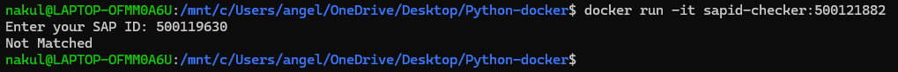
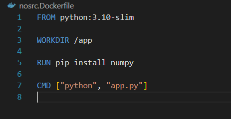
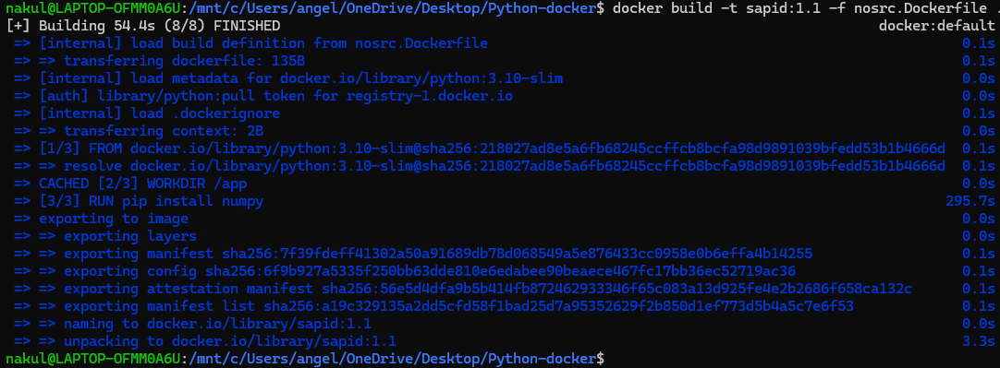

# Class 2 – Python Docker Application
## Subfolder: python-docker

---

## Objective
To containerize a Python application using Docker, build images using different Dockerfiles, run containers interactively, and analyze image layers.

```

## Step 1 – Python Application (app.py)

```python
import numpy as np

stored_sapid = "500121882"
user_sapid = input("Enter your SAP ID: ")

if user_sapid == stored_sapid:
    print("Matched")
else:
    print("Not Matched")
```



---

## Step 2 – Create Dockerfile

```dockerfile
FROM python:3.10-slim
WORKDIR /app
COPY app.py .
RUN pip install numpy
CMD ["python", "app.py"]
```



---

## Step 3 – Build Docker Image

Command:
```
docker build -t sapid-checker:500121882 .
```



---

## Step 4 – Run Container (Correct SAP ID)

Command:
```
docker run -it sapid-checker:500121882
```

Output:
Matched



---

## Step 5 – Run Container (Incorrect SAP ID)

Command:
```
docker run -it sapid-checker:500121882
```

Output:
Not Matched



---

## Step 6 – Check Image History

Command:
```
docker history sapid-checker:500121882
```


---

## Step 7 – Create Alternative Dockerfile (nosrc.Dockerfile)

```dockerfile
FROM python:3.10-slim
WORKDIR /app
RUN pip install numpy
CMD ["python", "app.py"]
```



---

## Step 8 – Build Image Using nosrc.Dockerfile

Command:
```
docker build -t sapid:1.1 -f nosrc.Dockerfile .
```



---

## Step 9 – Run Container with Volume Mount

Command:
```
docker run -it -v ./:/app sapid:1.1
```


---

## Result
Successfully:
- Containerized Python application
- Built Docker image
- Executed container with user input
- Verified correct and incorrect conditions
- Analyzed image layers using docker history
- Demonstrated volume mounting

