# Class 2 -- Docker Engine API Interaction via Unix Socket

## Objective

To interact directly with the Docker Engine REST API using curl and the
Unix socket without relying on standard Docker CLI lifecycle commands.

------------------------------------------------------------------------

## Environment

-   Windows 11
-   WSL Ubuntu 24.04
-   Docker Engine running
-   Communication via: /var/run/docker.sock

------------------------------------------------------------------------

## Step 1 -- Start WSL Environment

``` bash
wsl
```

Launches Ubuntu inside Windows.

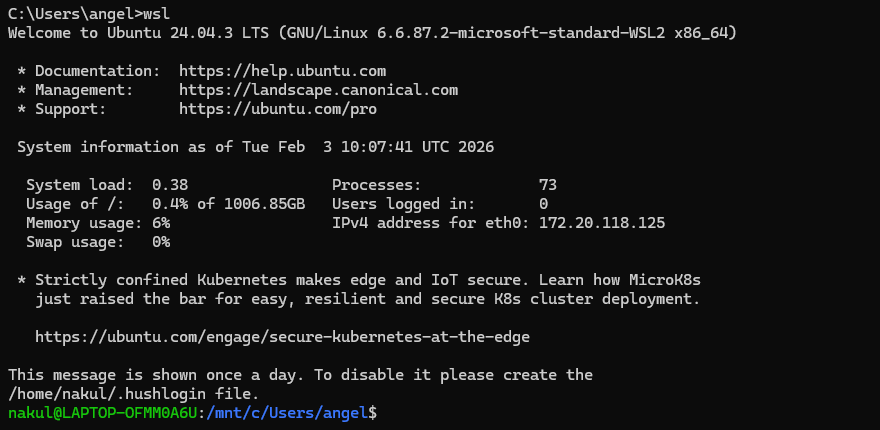

------------------------------------------------------------------------

## Step 2 -- Verify Docker Socket

``` bash
ls -l /var/run/docker.sock
```

Confirms Docker socket exists and shows permission details.

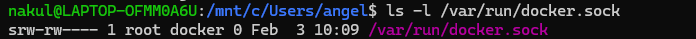

------------------------------------------------------------------------

## Step 3 -- Test Docker API Connectivity

``` bash
curl --unix-socket /var/run/docker.sock http://localhost/_ping
```

Expected Output: OK

Confirms Docker daemon is accessible via Unix socket.

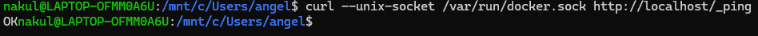

------------------------------------------------------------------------

## Step 4 -- Check Docker Version via API

``` bash
curl --unix-socket /var/run/docker.sock http://localhost/version
```

Returns Docker Engine details in JSON format.

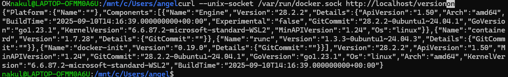

------------------------------------------------------------------------

## Step 5 -- List Containers using Docker CLI

``` bash
docker ps
docker ps -a
```

Displays running and stopped containers.

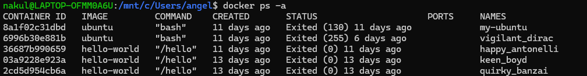

------------------------------------------------------------------------

## Step 6 -- List Containers via Docker API

``` bash
curl --unix-socket /var/run/docker.sock "http://localhost/v1.44/containers/json"

curl --unix-socket /var/run/docker.sock "http://localhost/v1.44/containers/json?all=true"
```

Retrieves container information in JSON format.

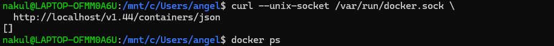
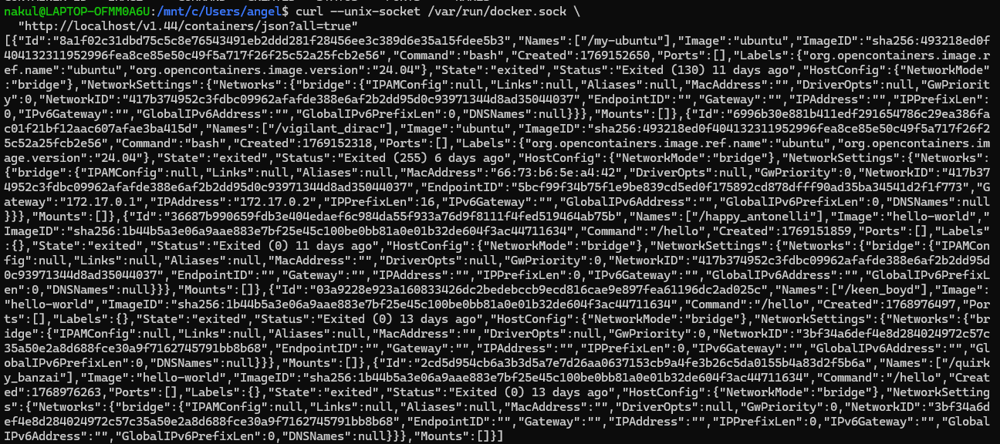

------------------------------------------------------------------------

## Step 7 -- Pull Nginx Image via API

``` bash
curl --unix-socket /var/run/docker.sock -X POST "http://localhost/v1.44/images/create?fromImage=nginx&tag=latest"
```

Downloads nginx image using Docker REST API.

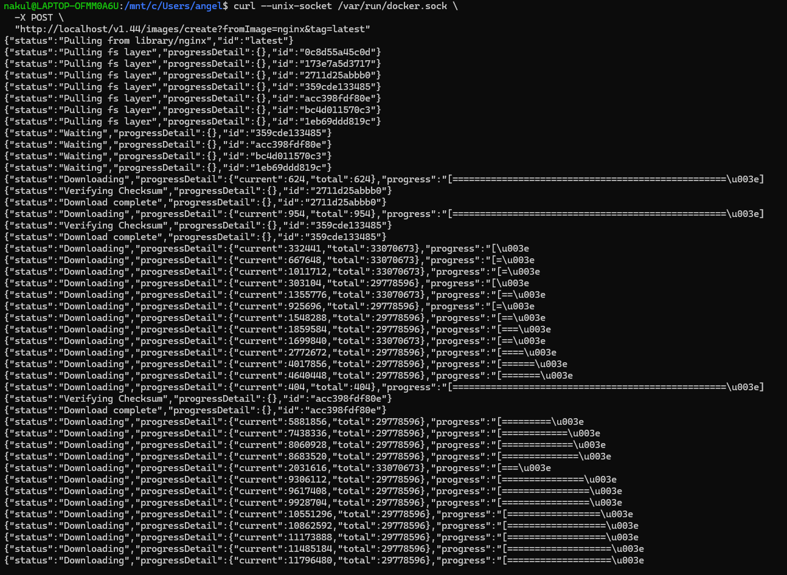

------------------------------------------------------------------------

## Step 8 -- Create Container via API

``` bash
curl --unix-socket /var/run/docker.sock -X POST -H "Content-Type: application/json" http://localhost/v1.44/containers/create?name=mynginx -d '{
  "Image": "nginx",
  "ExposedPorts": {
    "80/tcp": {}
  },
  "HostConfig": {
    "PortBindings": {
      "80/tcp": [
        { "HostPort": "8080" }
      ]
    }
  }
}'
```

Creates container named `mynginx` with port mapping 8080 to container
port 80.

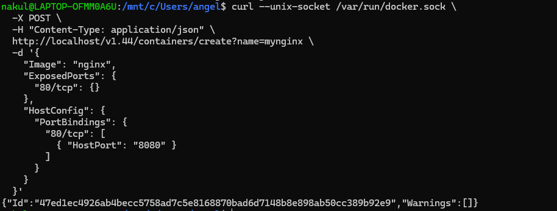

------------------------------------------------------------------------

## Step 9 -- Start Container via API

``` bash
curl --unix-socket /var/run/docker.sock -X POST http://localhost/v1.44/containers/mynginx/start
```

Starts the created container.

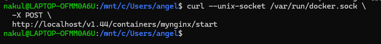

------------------------------------------------------------------------

## Step 10 -- Stop Container via API

``` bash
curl --unix-socket /var/run/docker.sock -X POST http://localhost/v1.44/containers/mynginx/stop
```

Stops the running container.

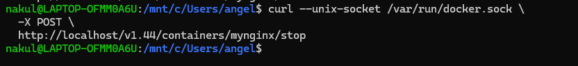

------------------------------------------------------------------------

## Step 11 -- Inspect Container via API

``` bash
curl --unix-socket /var/run/docker.sock http://localhost/v1.44/containers/mynginx/json
```

Displays detailed container metadata including state, mounts,
networking, and port bindings.

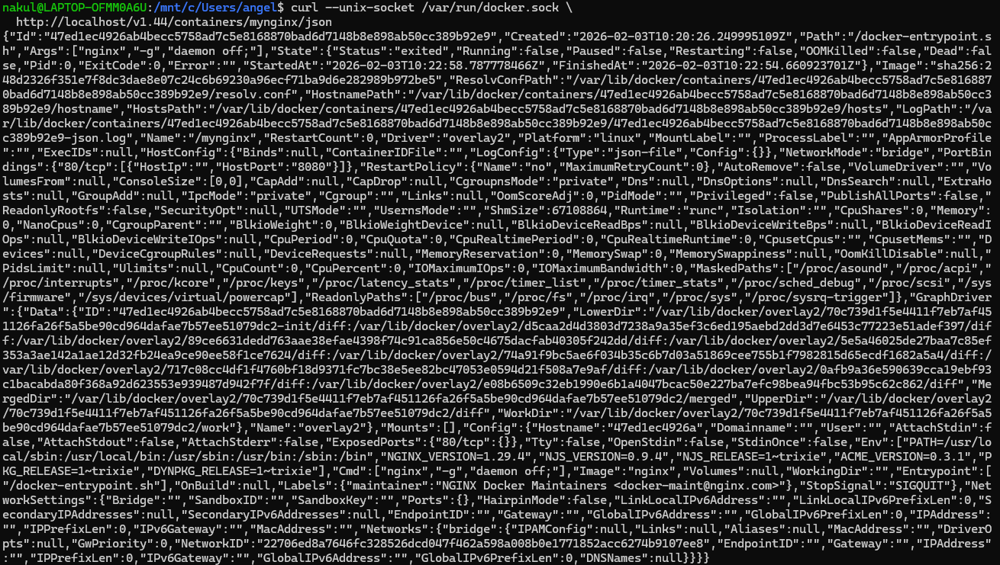

------------------------------------------------------------------------

## Step 12 -- Image Pull Detailed Output

Shows full layer download progress of nginx image via API.


------------------------------------------------------------------------

## Result

Successfully accessed Docker Engine directly via its REST API and
performed:

-   Socket verification
-   API connectivity test
-   Version inspection
-   Image pull
-   Container creation
-   Container start
-   Container stop
-   Container inspection

All operations were executed using HTTP requests over the Unix socket.

------------------------------------------------------------------------

## Learning Outcome

-   Docker CLI internally communicates with Docker daemon via REST API.
-   Docker daemon can be accessed directly through
    `/var/run/docker.sock`.
-   Full container lifecycle management can be performed using HTTP
    requests.
