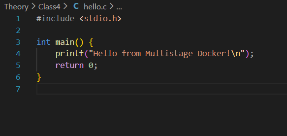
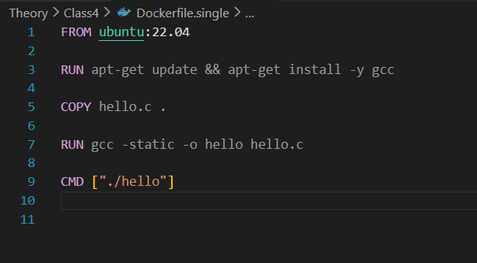
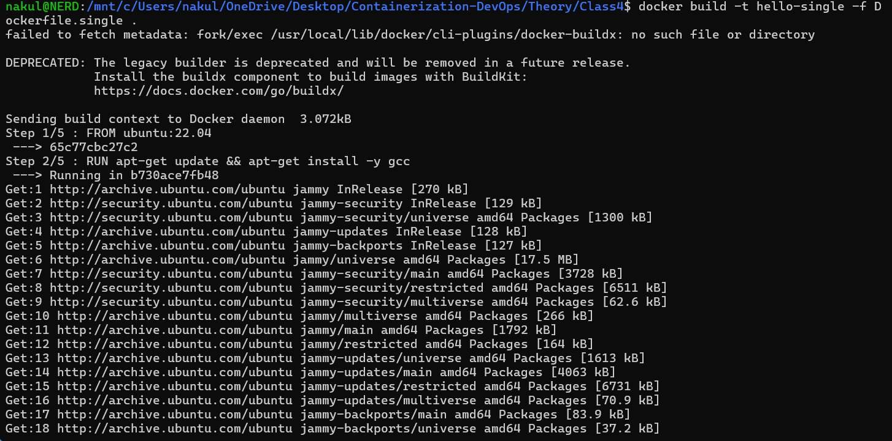
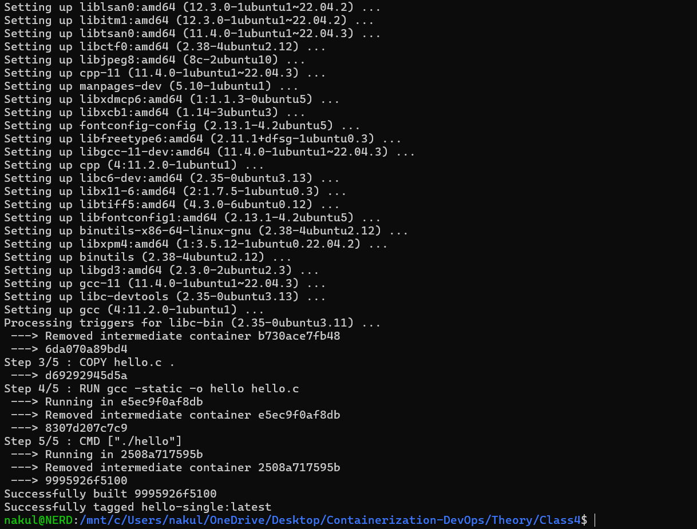
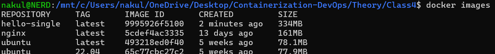
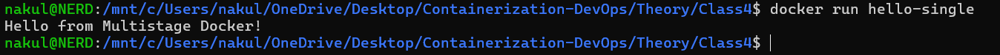
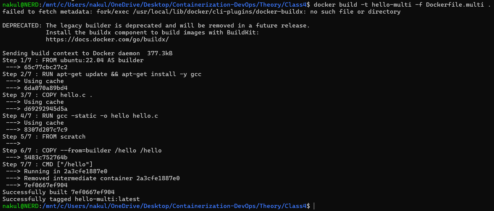
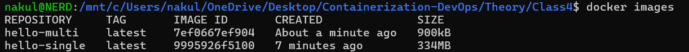

# Class 4 -- Multistage Docker Build (Hands-on)

## Objective

-   To understand the difference between Single-stage and Multistage
    Docker builds
-   To reduce Docker image size using Multistage builds
-   To compare final image sizes practically

------------------------------------------------------------------------

## Environment Used

-   Host OS: Windows
-   Linux Environment: WSL (Ubuntu 24.04)
-   Container Platform: Docker Engine
-   Terminal: WSL Ubuntu
-   Language Used: C

------------------------------------------------------------------------

## Experiment Execution with Screenshots

### Step 1: Create C Program (hello.c)

C program prints a simple message.



------------------------------------------------------------------------

### Step 2: Create Single Stage Dockerfile

Dockerfile installs GCC and builds the C program inside Ubuntu image.



------------------------------------------------------------------------

### Step 3: Build Single Stage Image

**Command executed:**

``` bash
docker build -t hello-single -f Dockerfile.single .
```



------------------------------------------------------------------------

### Step 4: Check Docker Images (Single Stage)

**Command executed:**

``` bash
docker images
```



------------------------------------------------------------------------

### Step 5: Run Single Stage Container

**Command executed:**

``` bash
docker run hello-single
```



------------------------------------------------------------------------

### Step 6: Create Multistage Dockerfile

Second Dockerfile uses builder stage and final scratch stage.



------------------------------------------------------------------------

### Step 7: Build Multistage Image

**Command executed:**

``` bash
docker build -t hello-multi -f Dockerfile.multi .
```



------------------------------------------------------------------------

### Step 8: Compare Image Sizes

**Command executed:**

``` bash
docker images
```



------------------------------------------------------------------------

### Step 9: Run Multistage Container

**Command executed:**

``` bash
docker run hello-multi
```


------------------------------------------------------------------------

## Result

Single-stage Docker image size was significantly larger because it
contained Ubuntu base image and GCC compiler.

Multistage Docker build produced a very small image by copying only the
compiled binary into a minimal scratch image.

------------------------------------------------------------------------

## Learning Outcome

-   Understood how Docker builds layers
-   Learned the concept of build stage and final stage
-   Compared image sizes practically
-   Learned how Multistage builds optimize production images
