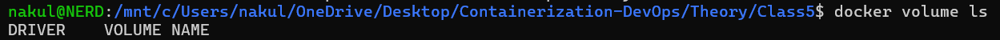
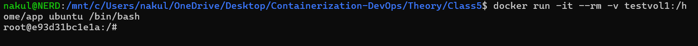
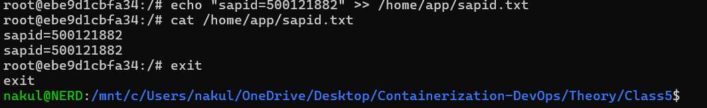
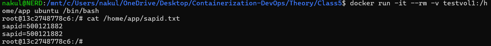
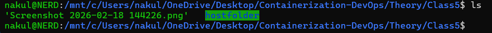
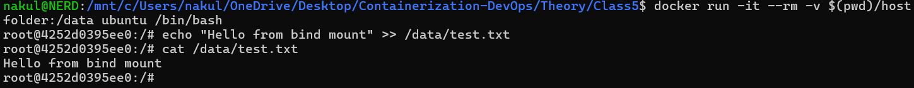
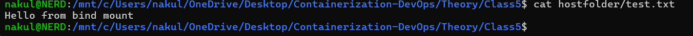
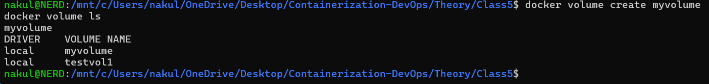

#  Class 5 -- Docker Volumes and Bind Mounts (Hands-on)

##  Objective

- To understand Docker data persistence concepts
- To differentiate between Volumes and Bind Mounts
- To verify data persistence across container restarts

------------------------------------------------------------------------

##  Environment Used

- Host OS: Windows 11
- Linux Environment: WSL (Ubuntu 24.04)
- Container Platform: Docker Engine
- Terminal: WSL Ubuntu

------------------------------------------------------------------------

##  Experiment Execution with Screenshots

### 🔹 Step 1: Check Existing Docker Volumes

Initially verifies if any volumes exist.

```bash
docker volume ls
```



------------------------------------------------------------------------

### 🔹 Step 2: Create a Named Volume

Creates a volume named `testvol1` and verifies it.

```bash
docker volume create testvol1
docker volume ls
```


------------------------------------------------------------------------

### 🔹 Step 3: Mount Volume to Container and Create File

Mounts the volume to `/home/app` and writes data.

```bash
docker run -it --rm -v testvol1:/home/app ubuntu /bin/bash
echo "sapid=500121882" >> /home/app/sapid.txt
cat /home/app/sapid.txt
exit
```



------------------------------------------------------------------------

### 🔹 Step 4: Verify Data Persistence

Runs a new container and checks if file persists.

```bash
docker run -it --rm -v testvol1:/home/app ubuntu /bin/bash
cat /home/app/sapid.txt
```



------------------------------------------------------------------------

### 🔹 Step 5: Bind Mount with Host Directory

Creates a host folder and mounts it to container.

```bash
docker run -it --rm -v $(pwd)/hostfolder:/data ubuntu /bin/bash
echo "Hello from bind mount" >> /data/test.txt
cat /data/test.txt
exit
```



------------------------------------------------------------------------

### 🔹 Step 6: Verify Data on Host System

Checks file directly from host directory.

```bash
cat hostfolder/test.txt
```



------------------------------------------------------------------------

### 🔹 Step 7: Create Another Named Volume

Creates volume `myvolume`.

```bash
docker volume create myvolume
docker volume ls
```



------------------------------------------------------------------------

### 🔹 Step 8: Write Data into Named Volume

Mounts `myvolume` and writes data.

```bash
docker run -it --rm -v myvolume:/data ubuntu /bin/bash
echo "Hello from named volume" >> /data/file.txt
cat /data/file.txt
exit
```



------------------------------------------------------------------------

### 🔹 Step 9: Verify Named Volume Persistence

Runs new container to confirm data persistence.

```bash
docker run -it --rm -v myvolume:/data ubuntu /bin/bash
cat /data/file.txt
```



------------------------------------------------------------------------

##  Result

Docker volumes and bind mounts were successfully created and tested.  
Data persisted across multiple container executions.

------------------------------------------------------------------------

##  Learning Outcome

- Understood difference between Volumes and Bind Mounts
- Verified persistent storage in Docker
- Observed data sharing between container and host
- Learned practical data management techniques in Docker
