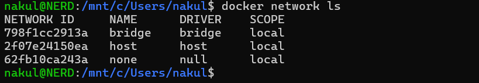
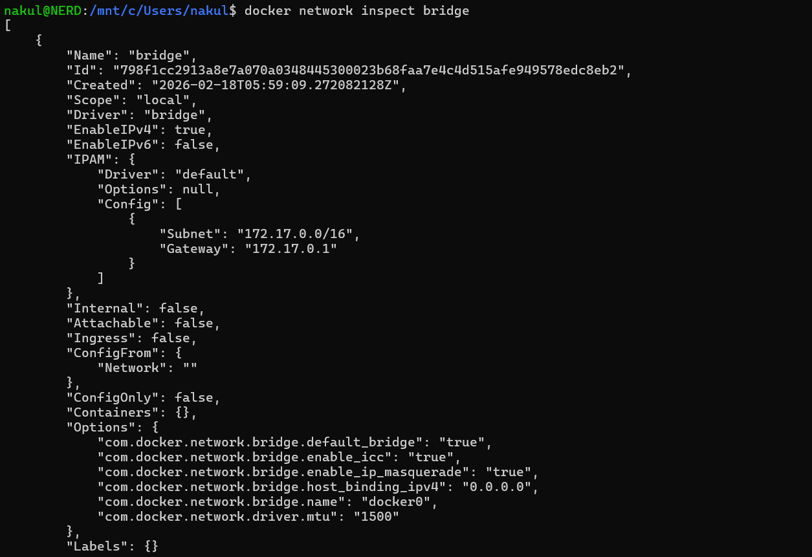
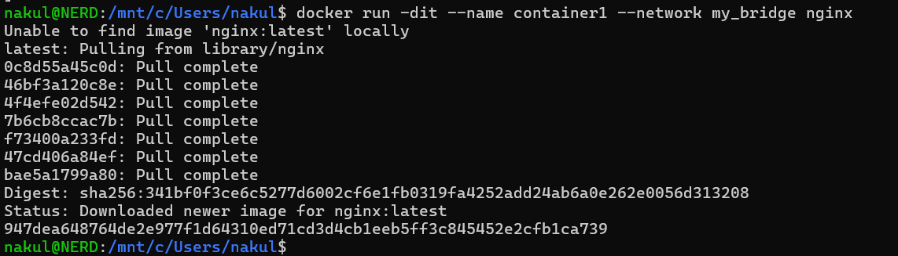
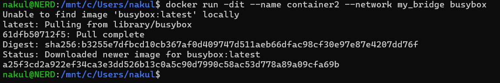
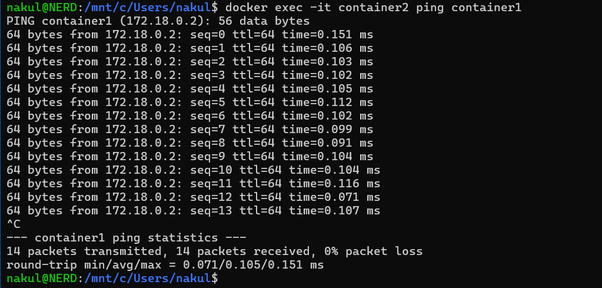
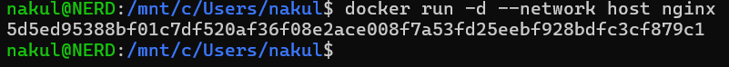
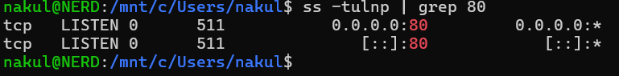

# Class 6 -- Docker Networking (Hands-on)

## Objective

- To understand Docker default networks
- To inspect bridge network configuration
- To create a custom bridge network
- To connect containers within same network
- To test container-to-container communication
- To understand host network mode

------------------------------------------------------------------------

## Environment Used

- Host OS: Windows
- Linux Environment: WSL Ubuntu
- Container Platform: Docker Engine
- Terminal: WSL Ubuntu

------------------------------------------------------------------------

## Experiment Execution with Screenshots

### Step 1: List Available Docker Networks

**Command executed:**

```bash
docker network ls
```



------------------------------------------------------------------------

### Step 2: Inspect Default Bridge Network

**Command executed:**

```bash
docker network inspect bridge
```



------------------------------------------------------------------------

### Step 3: Create Custom Bridge Network

**Command executed:**

```bash
docker network create my_bridge
docker network inspect my_bridge
```


------------------------------------------------------------------------

### Step 4: Run Nginx Container in Custom Network

**Command executed:**

```bash
docker run -dit --name container1 --network my_bridge nginx
```



------------------------------------------------------------------------

### Step 5: Run BusyBox Container in Same Network

**Command executed:**

```bash
docker run -dit --name container2 --network my_bridge busybox
```



------------------------------------------------------------------------

### Step 6: Test Container-to-Container Communication

**Command executed:**

```bash
docker exec -it container2 ping container1
```



------------------------------------------------------------------------

### Step 7: Run Container in Host Network Mode

**Command executed:**

```bash
docker run -d --network host nginx
```



------------------------------------------------------------------------

### Step 8: Verify Listening Ports on Host

**Command executed:**

```bash
ss -tulnp | grep 80
```



------------------------------------------------------------------------
