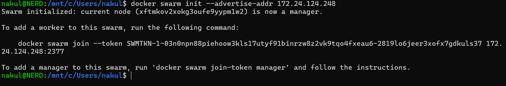
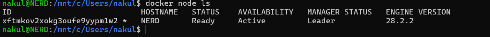
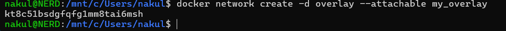
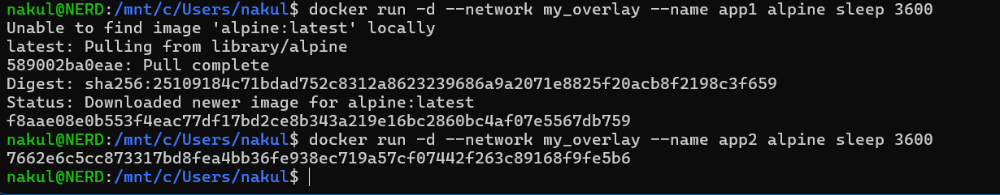
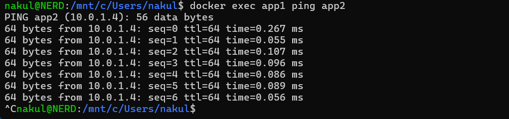
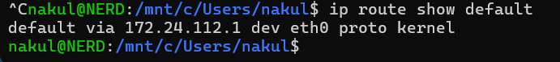
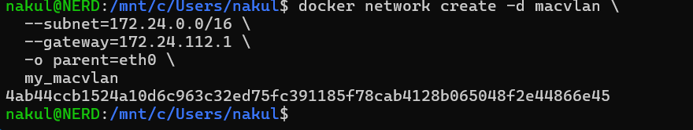
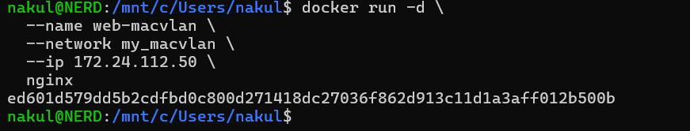

# Class 7 -- Docker Swarm, Overlay, and Macvlan Networking (Hands-on)

## Objective

- To initialize Docker Swarm mode correctly on a host with multiple network interfaces
- To inspect swarm node status
- To create and use an overlay network for container communication
- To verify container-to-container connectivity
- To inspect host default routing
- To create and use a macvlan network with a static container IP

------------------------------------------------------------------------

## Environment Used

- Host OS: Windows
- Linux Environment: WSL Ubuntu
- Container Platform: Docker Engine
- Terminal: WSL Ubuntu

------------------------------------------------------------------------

## Experiment Execution with Screenshots

### Step 1: Initialize Docker Swarm (Error - Multiple IPs)

**Command executed:**

```bash
docker swarm init
```

**Observed error:**

```text
Error response from daemon: could not choose an IP address to advertise since this system has multiple addresses on different interfaces (10.255.255.254 on lo and 172.24.124.248 on eth0) - specify one with --advertise-addr
```


------------------------------------------------------------------------

### Step 2: Initialize Swarm with Advertise Address

**Command executed:**

```bash
docker swarm init --advertise-addr 172.24.124.248
```



------------------------------------------------------------------------

### Step 3: List Swarm Nodes

**Command executed:**

```bash
docker node ls
```



------------------------------------------------------------------------

### Step 4: Create Overlay Network

**Command executed:**

```bash
docker network create -d overlay --attachable my_overlay
```



------------------------------------------------------------------------

### Step 5: Run Containers in Overlay Network

**Command executed:**

```bash
docker run -d --network my_overlay --name app1 alpine sleep 3600
docker run -d --network my_overlay --name app2 alpine sleep 3600
```



------------------------------------------------------------------------

### Step 6: Test Connectivity Between Containers

**Command executed:**

```bash
docker exec app1 ping app2
```



------------------------------------------------------------------------

### Step 7: Check Default Route

**Command executed:**

```bash
ip route show default
```



------------------------------------------------------------------------

### Step 8: Create Macvlan Network

**Command executed:**

```bash
docker network create -d macvlan \
  --subnet=172.24.0.0/16 \
  --gateway=172.24.112.1 \
  -o parent=eth0 \
  my_macvlan
```



------------------------------------------------------------------------

### Step 9: Run Nginx Container with Static IP on Macvlan

**Command executed:**

```bash
docker run -d \
  --name web-macvlan \
  --network my_macvlan \
  --ip 172.24.112.50 \
  nginx
```



------------------------------------------------------------------------

## Result

Docker Swarm was successfully initialized using an explicit advertise address. Overlay and macvlan networks were created, containers were deployed, and connectivity/routing checks were validated.

------------------------------------------------------------------------

## Learning Outcome

- Learned why `docker swarm init` can fail on hosts with multiple interface IPs
- Understood how `--advertise-addr` resolves swarm initialization ambiguity
- Practiced creating and using attachable overlay networks
- Verified inter-container communication in swarm networking context
- Created a macvlan network and assigned a static IP to a container
