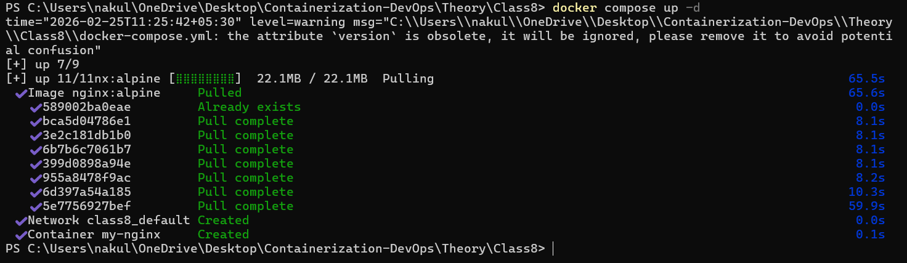
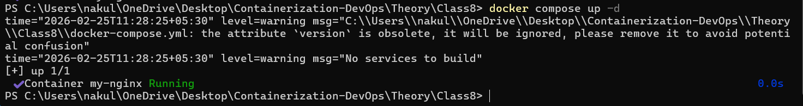
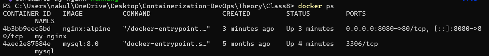
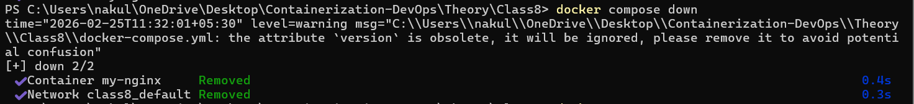
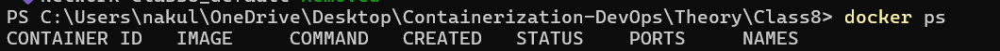
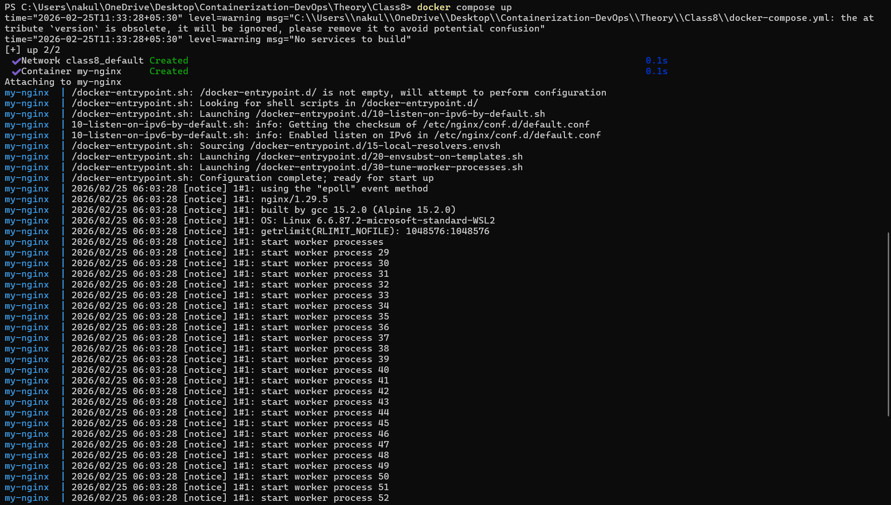
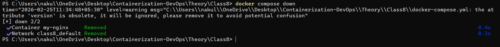
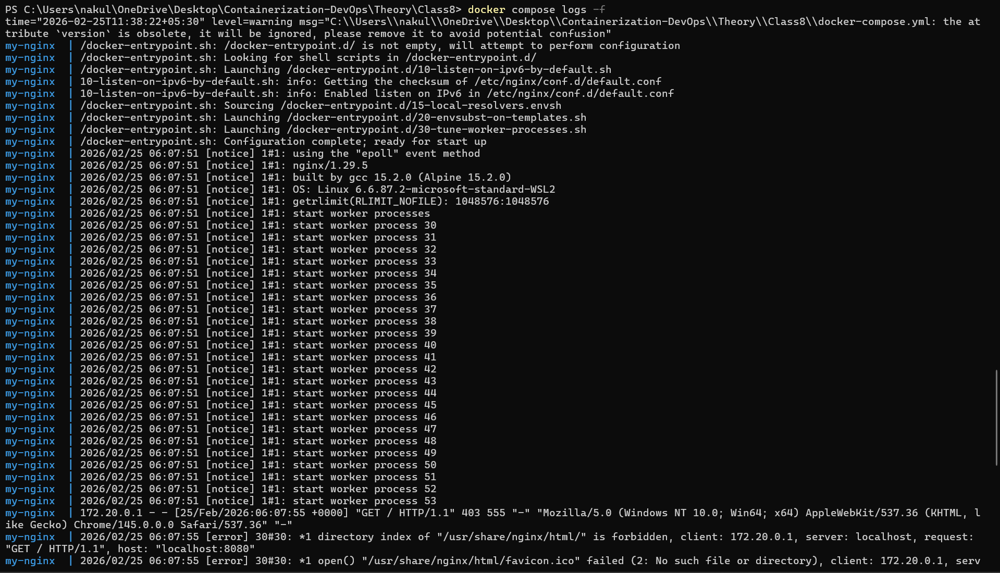
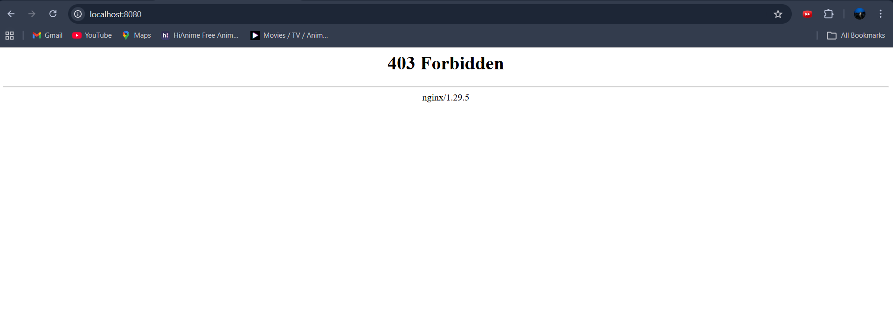

# Docker Compose Lab -- Class 8

## docker-compose.yml

``` yaml
version: '3.8'
services:
  nginx:
    image: nginx:alpine
    container_name: my-nginx
    ports:
      - "8080:80"
    volumes:
      - ./html:/usr/share/nginx/html
    environment:
      - NGINX_HOST=localhost
    restart: unless-stopped
```

------------------------------------------------------------------------

## Step 1
### Command Used

``` bash
docker compose up -d
```




------------------------------------------------------------------------

## Step 2

### Command Used
``` bash
docker compose up -d
```



------------------------------------------------------------------------

## Step 3
### Command Used

``` bash
docker ps
```



------------------------------------------------------------------------

## Step 4
### Command Used

``` bash
docker compose down
```




------------------------------------------------------------------------

## Step 5
### Command Used

``` bash
docker ps
```




------------------------------------------------------------------------

## Step 6

### Command Used

``` bash
docker compose up
```



------------------------------------------------------------------------

## Step 7
### Command Used

``` bash
docker compose down
```



------------------------------------------------------------------------

## Step 8
### Command Used
``` bash
docker compose logs -f
```



------------------------------------------------------------------------

## Step 9

### Command Used

Access in browser: http://localhost:8080




------------------------------------------------------------------------

## Step 10

### Command Used

``` bash
docker compose ps
```


------------------------------------------------------------------------
