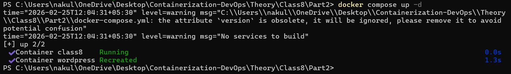
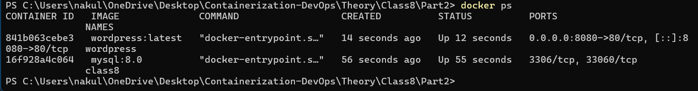
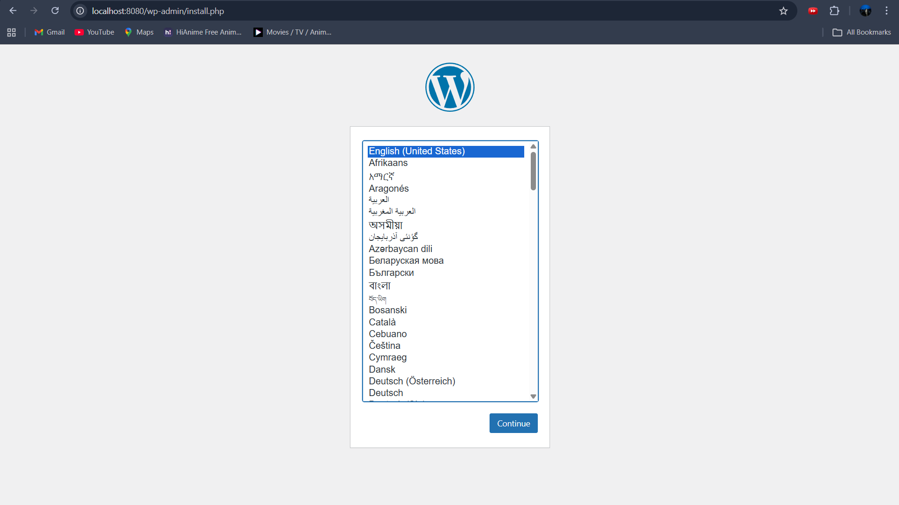

# Docker Compose Lab -- Class 8 (Part 2)

## docker-compose.yml

``` yaml
version: '3.8'

services:
  mysql:
    image: mysql:8.0
    container_name: class8
    environment:
      MYSQL_ROOT_PASSWORD: secret
      MYSQL_DATABASE: wordpress
      MYSQL_USER: wpuser
      MYSQL_PASSWORD: wppass
    volumes:
      - mysql_data:/var/lib/mysql
    networks:
      - wordpress-network

  wordpress:
    image: wordpress:latest
    container_name: wordpress
    ports:
      - "8080:80"
    environment:
      WORDPRESS_DB_HOST: mysql
      WORDPRESS_DB_USER: wpuser
      WORDPRESS_DB_PASSWORD: wppass
      WORDPRESS_DB_NAME: wordpress
    volumes:
      - wp_content:/var/www/html/wp-content
    depends_on:
      - mysql
    networks:
      - wordpress-network

volumes:
  mysql_data:
  wp_content:

networks:
  wordpress-network:
```

------------------------------------------------------------------------

## Step 1: Start the Containers

``` bash
docker compose up -d
```



------------------------------------------------------------------------

## Step 2: Verify Running Containers

``` bash
docker ps
```


------------------------------------------------------------------------

## Step 3: Access WordPress in Browser

Open:

http://localhost:8080


------------------------------------------------------------------------

## Step 4: WordPress Installation Page

http://localhost:8080/wp-admin/install.php



------------------------------------------------------------------------

## Conclusion

-   Deployed MySQL and WordPress using Docker Compose\
-   Configured environment variables for DB connection\
-   Used volumes for persistent storage\
-   Successfully accessed WordPress setup page
