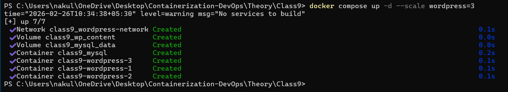
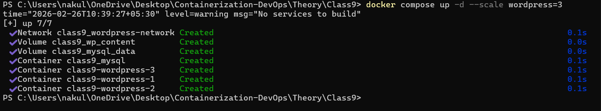

# Docker Compose Scaling -- Class 9

## Objective

This experiment demonstrates horizontal scaling in Docker Compose using
two different approaches:

1.  Removing Port Mapping (Internal Scaling Only)
2.  Using Port Range Mapping (Multiple External Ports)

------------------------------------------------------------------------

# Approach 1: Removing Port Mapping (Internal Scaling)

In this approach, we removed the `ports` section from the WordPress
service. This allows scaling without port conflicts, but WordPress is
not directly accessible from the browser.

## docker-compose.yml (No Port Mapping)

``` yaml
services:
  mysql:
    image: mysql:8.0
    container_name: class9_mysql
    environment:
      MYSQL_ROOT_PASSWORD: secret
      MYSQL_DATABASE: wordpress
      MYSQL_USER: wpuser
      MYSQL_PASSWORD: wppass
    volumes:
      - mysql_data:/var/lib/mysql
    networks:
      - wordpress-network

  wordpress:
    image: wordpress:latest
    environment:
      WORDPRESS_DB_HOST: mysql
      WORDPRESS_DB_USER: wpuser
      WORDPRESS_DB_PASSWORD: wppass
      WORDPRESS_DB_NAME: wordpress
    volumes:
      - wp_content:/var/www/html/wp-content
    depends_on:
      - mysql
    networks:
      - wordpress-network

volumes:
  mysql_data:
  wp_content:

networks:
  wordpress-network:
```

## Scaling Command

    docker compose up -d --scale wordpress=3

This created:

-   class9-wordpress-1
-   class9-wordpress-2
-   class9-wordpress-3

------------------------------------------------------------------------

# Approach 2: Port Range Mapping

In this approach, we used a port range to allow multiple containers to
bind to different host ports.

## docker-compose.yml (Port Range Mapping)

``` yaml
services:
  mysql:
    image: mysql:8.0
    container_name: class9_mysql
    environment:
      MYSQL_ROOT_PASSWORD: secret
      MYSQL_DATABASE: wordpress
      MYSQL_USER: wpuser
      MYSQL_PASSWORD: wppass
    volumes:
      - mysql_data:/var/lib/mysql
    networks:
      - wordpress-network

  wordpress:
    image: wordpress:latest
    ports:
      - "8080-8082:80"
    environment:
      WORDPRESS_DB_HOST: mysql
      WORDPRESS_DB_USER: wpuser
      WORDPRESS_DB_PASSWORD: wppass
      WORDPRESS_DB_NAME: wordpress
    volumes:
      - wp_content:/var/www/html/wp-content
    depends_on:
      - mysql
    networks:
      - wordpress-network

volumes:
  mysql_data:
  wp_content:

networks:
  wordpress-network:
```

## Scaling Command

    docker compose up -d --scale wordpress=3

This mapped:

-   wordpress-1 → localhost:8080
-   wordpress-2 → localhost:8081
-   wordpress-3 → localhost:8082

------------------------------------------------------------------------

# Screenshots

## Screenshot 1



## Screenshot 2



------------------------------------------------------------------------

# Key Concepts Learned

-   Port conflicts occur when scaling with fixed host ports
-   Removing ports allows internal-only scaling
-   Port range mapping allows multiple external access points
-   Horizontal scaling creates multiple container replicas
-   Docker Compose uses service names for networking

------------------------------------------------------------------------

# Conclusion

The experiment successfully demonstrated two methods of scaling
WordPress containers using Docker Compose. Both approaches highlight
important differences in how Docker handles port binding and service
replication.
