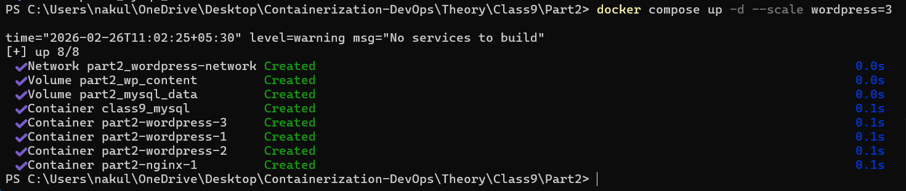

# Docker Compose Scaling with Nginx Reverse Proxy -- Class 9 Part 2

## Objective

This experiment demonstrates horizontal scaling using Docker Compose
with a reverse proxy (Nginx).\
Multiple WordPress containers are deployed and traffic is routed through
Nginx as a single entry point.

------------------------------------------------------------------------

## Architecture Overview

Browser\
↓\
Nginx (Port 8080)\
↓\
WordPress (3 Replicas)\
↓\
MySQL Database

This setup implements a 3-tier architecture:

-   Presentation Layer → Nginx\
-   Application Layer → WordPress (Scaled)\
-   Database Layer → MySQL

------------------------------------------------------------------------

# docker-compose.yml

``` yaml
services:
  mysql:
    image: mysql:8.0
    container_name: class9_mysql
    environment:
      MYSQL_ROOT_PASSWORD: secret
      MYSQL_DATABASE: wordpress
      MYSQL_USER: wpuser
      MYSQL_PASSWORD: wppass
    volumes:
      - mysql_data:/var/lib/mysql
    networks:
      - wordpress-network

  wordpress:
    image: wordpress:latest
    expose:
      - "80"
    environment:
      WORDPRESS_DB_HOST: mysql
      WORDPRESS_DB_USER: wpuser
      WORDPRESS_DB_PASSWORD: wppass
      WORDPRESS_DB_NAME: wordpress
    volumes:
      - wp_content:/var/www/html/wp-content
    depends_on:
      - mysql
    networks:
      - wordpress-network

  nginx:
    image: nginx:latest
    ports:
      - "8080:80"
    volumes:
      - ./nginx.conf:/etc/nginx/nginx.conf
    depends_on:
      - wordpress
    networks:
      - wordpress-network

volumes:
  mysql_data:
  wp_content:

networks:
  wordpress-network:
```

------------------------------------------------------------------------

# nginx.conf

``` nginx
events {}

http {
    upstream wordpress {
        server wordpress:80;
    }

    server {
        listen 80;

        location / {
            proxy_pass http://wordpress;
            proxy_set_header Host $host;
            proxy_set_header X-Real-IP $remote_addr;
        }
    }
}
```

------------------------------------------------------------------------

## Scaling Command Used

    docker compose up -d --scale wordpress=3



------------------------------------------------------------------------

## Output Observed

Containers Created:

-   class9_mysql\
-   part2-wordpress-1\
-   part2-wordpress-2\
-   part2-wordpress-3\
-   part2-nginx-1

Docker automatically created:

-   Network → part2_wordpress-network\
-   Volumes → part2_mysql_data, part2_wp_content

------------------------------------------------------------------------

## Key Concepts Learned

1.  Why port conflicts happen when scaling with fixed ports\
2.  Difference between `ports` and `expose`\
3.  Horizontal scaling using `--scale`\
4.  Reverse proxy architecture\
5.  Docker internal DNS resolution\
6.  Load balancing using Nginx upstream

------------------------------------------------------------------------

## Conclusion

This experiment successfully demonstrated:

-   Horizontal scaling of application containers
-   Reverse proxy configuration using Nginx
-   Service isolation using Docker networks
-   Production-style container architecture

The system now follows a scalable multi-container design where only
Nginx is publicly exposed and WordPress replicas are internally load
balanced.
